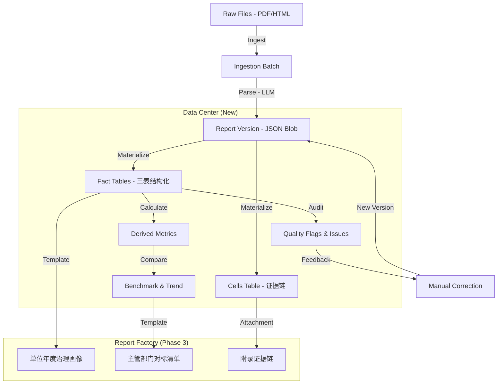

# KIROGOVCOMPARE Data Center Renovation Plan v2.1

**Version**: 2.1 (Engineering Review Ready)  
**Date**: 2026-01-13  
**Scope**: 政务公开年报三张标准表（主动公开 / 依申请 / 复议诉讼）数据中心建设

---

## Diff Summary（与 v2 的差异摘要）

### 新增内容块

1. **§5. 指标字典（Metric Dictionary）**：新增口径资产管理，包含字段规范、版本化治理机制与发布流程
2. **§4.3 Cells 语义规范**：明确 `0/空/不适用` 语义区分（`value_semantic` enum），证据链核心设计
3. **§8. 页面/功能规划**：补齐 Data Center UI 最小信息架构（Overview/Facts/Benchmark/Quality/Drill-down/Export）
4. **§6. 批次导入（Ingestion Batches）**：新增 `ingestion_batches` 表结构，支持可观测、按批次回滚/重跑
5. **§10. 报告工厂（Report Factory）**：将 Phase 3 报告导出升级为产品化工厂模块，含两类报告模板与 AI 边界说明
6. **§11. 验收与回归测试**：新增版本留痕验收、materialize 幂等、最小质量规则集（≥10 条）、金标回归集

### 修正要点

- ✅ 全文删除所有 `file:///d:/...` 本地路径链接，改为纯文本或仓库相对路径引用
- ✅ 所有示例验收指标围绕"年报三表"（主动公开/依申请/复议诉讼）
- ✅ 每个 Phase 末尾增加：**交付物清单** + **验收标准** + **风险与对策** + **回归测试点**

---

## 1. 背景与现状

### 现有系统

- **用途**：政府信息公开年度报告比对与质量审计
- **核心表**：
  - `reports`：报告主体元数据
  - `report_versions`：版本/文件（含 parsed_json）
  - `jobs`：异步任务队列
  - `comparisons`：年度比对结果
- **部署架构**：甲骨文云（PostgreSQL）+ 本地开发（SQLite）

### 关键痛点

| 痛点 | 描述 | 影响 |
|------|------|------|
| **版本覆盖风险** | 手工修正 `parsed_json` 直接覆盖记录，原始解析结果丢失 | 无法回溯、审计失效 |
| **数据结构耦合** | `parsed_json` 是大 JSON Blob，难以进行 SQL 查询与统计 | 查询性能差、无法细粒度审计 |
| **口径不统一** | 缺乏指标字典，同一指标存在多种计算口径 | 报告解释不一致、难以横向对标 |
| **语义丢失** | 原值 "0"、空字符串、"/"、"不适用" 混用，无法区分 | 计算逻辑污染、证据链断裂 |

---

## 2. 改造总体目标

本次改造 (v2.1) 范围**严格冻结**为以下三部分：

### A) 版本治理（基石）

- **不可变版本**：任何对 `parsed_json` 的编辑都必须生成新的 `report_version`
- **指针管理**：`reports` 表维护 `active_version_id` 指针，指向当前生效版本
- **状态机引入**：版本状态流转（`parsed` → `qa_failed` → `manual_corrected` → `customer_confirmed`）
- **前台体验**：默认展示 Current 版本，提供折叠式历史版本回溯

### B) 数据中心（核心）

围绕年报的核心"三张表"（主动公开、依申请、复议诉讼）进行数据下沉：

| 层次 | 描述 | 核心价值 |
|------|------|---------|
| **Cells（单元格层）** | 保留 OCR/LLM 解析的原始单元格数据 | 证据链溯源 |
| **Facts（事实层）** | JSON 展平为关系型数据 | 结构化查询 |
| **Derived（派生层）** | 预计算指标（主动公开总数、同比增长率等） | 高性能统计 |
| **Quality（质量层）** | 勾稽校验结果、异常标记、人工审核记录 | 质量治理 |

### C) 行业壁垒（护城河）

1. **口径治理**：指标字典（Metric Dictionary）统一计算口径，支持版本化
2. **证据链**：Cells 语义规范（区分 0/空/不适用），Facts 可钻取到原值
3. **质量校验与对标趋势**：勾稽恒等式、异常突变检测、同类单位分位数对标
4. **报告工厂化交付**：模板化报告生成，AI 辅助解释但最终结论来自显式规则

---

## 3. 总体架构

### 数据分层架构



### 数据流

1. **Ingest**: 批量上传文件 → 创建 `ingestion_batch` → 逐个创建 `reports` → 触发 Parse Job
2. **Parse**: LLM 解析 → 生成初始 `report_version` (JSON) → `is_active=true`
3. **Materialize** (New): 监听 Version 变更 → 异步展平 JSON 到 `facts` 和 `cells` 表
4. **Quality Check**: 基于 `facts` 表运行 SQL 规则 → 生成 `quality_issues`
5. **Benchmark**: 基于 `derived` 表计算分位数、趋势 → 可视化对标
6. **Correction**: 用户在 UI 修改数据 → 生成新 `report_version` → 触发新的 Materialize 流程
7. **Export**: 按模板生成报告 → 附加证据链与字典说明

---

## 4. 数据模型设计

> **注**：需兼容 PostgreSQL (Prod) 和 SQLite (Dev)

### 4.1 核心表 ERD

| 表名 | 字段 | 说明 |
|------|------|------|
| **reports** | `id`, `region_id`, `year`, `unit_name`, `active_version_id` (FK), `created_at`, `updated_at` | 报告主体 |
| **report_versions** | `id`, `report_id` (FK), `parsed_json` (JSONB/TEXT), `file_hash`, `parent_version_id` (FK), `state` (enum), `created_by`, `batch_id` (FK), `schema_version` | 版本（不可变） |
| **fact_active_disclosure** | `id`, `report_id`, `version_id`, `category`, `made_count`, `processed_count`, ... | 表2: 主动公开 |
| **fact_application** | `id`, `report_id`, `version_id`, `applicant_type`, `response_type`, `count`, ... | 表3: 依申请 |
| **fact_legal_proceeding** | `id`, `report_id`, `version_id`, `type`, `result_type`, `count`, ... | 表4: 复议诉讼 |
| **quality_issues** | `id`, `report_id`, `version_id`, `rule_code`, `severity`, `description`, `cell_ref`, `auto_status`, `human_status` | 质量问题 |

### 4.2 新增表：cells（证据链核心）

```sql
CREATE TABLE cells (
    id              SERIAL PRIMARY KEY,
    version_id      INTEGER NOT NULL REFERENCES report_versions(id),
    table_id        TEXT NOT NULL,           -- e.g., 'table_2', 'table_3', 'table_4'
    row_key         TEXT NOT NULL,           -- 行标识（如 "主动公开-规章"）
    col_key         TEXT NOT NULL,           -- 列标识（如 "本年发布件数"）
    cell_ref        TEXT NOT NULL,           -- 复合引用键 "{table_id}:{row_key}:{col_key}"
    
    -- 原值与语义
    value_raw       TEXT,                    -- OCR/LLM 提取的原始文本
    value_num       NUMERIC,                 -- 数值（nullable, 仅 NUMERIC 语义时填充）
    value_semantic  TEXT NOT NULL DEFAULT 'TEXT',  -- enum: 'ZERO'|'EMPTY'|'NA'|'TEXT'|'NUMERIC'
    normalized_value TEXT,                   -- 标准化后的值（可选，便于展示）
    
    -- 溯源（可选扩展）
    page_number     INTEGER,
    bbox_json       TEXT,                    -- 边界框坐标 JSON（预留）
    confidence      REAL,                    -- OCR/LLM 置信度
    
    created_at      TIMESTAMP DEFAULT CURRENT_TIMESTAMP,
    
    UNIQUE(version_id, cell_ref)
);

CREATE INDEX idx_cells_version ON cells(version_id);
CREATE INDEX idx_cells_table ON cells(version_id, table_id);
```

### 4.3 Cells 语义规范（0/空/不适用）

| value_semantic | 含义 | value_raw 示例 | value_num | 计算规则 |
|----------------|------|----------------|-----------|----------|
| `ZERO` | 显式零值 | "0", "0件", "零" | 0 | 参与求和 |
| `EMPTY` | 空白单元格 | "", null | null | **不参与计算，标记缺失** |
| `NA` | 明确不适用 | "/", "-", "—", "不适用", "N/A" | null | **不参与计算，不算缺失** |
| `TEXT` | 非数值文本 | "详见附表", "略" | null | 记录原文，不参与数值计算 |
| `NUMERIC` | 有效数值 | "123", "1,234.56" | 123 / 1234.56 | 正常参与计算 |

**核心规则**：

1. **禁止猜测性补零**：facts/derived 计算不得将 `EMPTY`/`NA` 替换为 0
2. **保留语义**：任何聚合查询必须携带语义信息或明确过滤条件
3. **可钻取**：facts 表的任何数值都能通过 `cell_ref` 追溯到 cells 原值
4. **质量指标**：统计 0/空/NA 分布，在质量页面可钻取查看

### 4.4 迁移策略

- **Double Write**: 暂时保留 `parsed_json` 作为 Source of Truth
- **Lazy Materialization**: 部署后，后台启动任务将现有 `active` 版本的 JSON 刷入 Facts/Cells 表
- **Schema Version**: 每次表结构变更需同步更新 `report_versions.schema_version`

---

## 5. 指标字典（Metric Dictionary）

### 5.1 为什么必须做

| 需求 | 说明 |
|------|------|
| **口径统一** | 同一指标（如"主动公开总数"）在不同地区、不同年份的计算方式必须一致 |
| **抗质疑** | 外部审计时，能够明确解释每个指标的定义、来源和计算方法 |
| **报告解释一致性** | 自动生成报告时，指标描述与数据来源需从字典动态获取 |

### 5.2 表结构设计

```sql
CREATE TABLE metric_dictionary (
    id                  SERIAL PRIMARY KEY,
    metric_key          TEXT NOT NULL UNIQUE,   -- e.g., 'active_disclosure_total'
    display_name        TEXT NOT NULL,          -- e.g., '主动公开总数'
    description         TEXT,                   -- 指标详细说明
    unit                TEXT DEFAULT '件',      -- 单位
    aggregatable        BOOLEAN DEFAULT TRUE,   -- 是否可聚合求和
    
    formula_sql_or_expr TEXT,                   -- SQL 表达式或计算公式
    source_table        TEXT NOT NULL,          -- 'facts' | 'derived' | 'cells'
    source_column       TEXT,                   -- 来源字段
    dims_supported      TEXT,                   -- JSON 数组：支持的维度，如 '["region","year"]'
    
    caveats             TEXT,                   -- 常见口径差异说明
    interpretation_template TEXT,               -- 报告解释模板（支持变量替换）
    
    -- 版本管理
    version             INTEGER DEFAULT 1,      -- 口径版本
    effective_from      DATE,                   -- 生效日期
    deprecated_at       DATE,                   -- 废弃日期（null=有效）
    superseded_by       TEXT,                   -- 被替代的新 metric_key
    
    created_at          TIMESTAMP DEFAULT CURRENT_TIMESTAMP,
    updated_at          TIMESTAMP DEFAULT CURRENT_TIMESTAMP
);

CREATE INDEX idx_metric_dict_key ON metric_dictionary(metric_key);
CREATE INDEX idx_metric_dict_active ON metric_dictionary(deprecated_at) WHERE deprecated_at IS NULL;
```

### 5.3 示例数据（三表相关）

| metric_key | display_name | formula_sql_or_expr | source_table | caveats |
|------------|--------------|---------------------|--------------|---------|
| `active_disclosure_total` | 主动公开总数 | `SUM(made_count) WHERE table='fact_active_disclosure'` | facts | 部分地区将"规范性文件"与"规章"合并统计 |
| `application_received_total` | 依申请收到总数 | `SUM(count) WHERE applicant_type IN ('自然人','法人')` | facts | 注意区分"本年新收"与"上年结转" |
| `application_response_rate` | 依申请答复率 | `(答复数 / 收到数) * 100` | derived | 若收到数为 0，标记为 NA 而非 100% |
| `legal_maintain_rate` | 复议诉讼维持率 | `(维持数 / 结案总数) * 100` | derived | 仅计算有结案的复议/诉讼 |

### 5.4 口径治理机制

1. **版本化管理**：
   - 新增/变更指标需递增 `version`
   - 废弃旧版本需设置 `deprecated_at` 并填写 `superseded_by`
   - 历史报告绑定当时的 metric_version，新报告使用最新版本

2. **与 report_version/schema_version 关系**：
   - `report_versions.schema_version` 记录表结构版本
   - 报告生成时记录使用的 `metric_dictionary.version`
   - 口径变更不强制重算历史，但需标注差异

3. **发布流程与回滚策略**：
   ```
   Draft → Review → Published → (Deprecated)
   ```
   - **Draft**: 仅开发环境可见
   - **Review**: 需管理员审批
   - **Published**: 正式生效，写入生产
   - **回滚**: 将当前版本 deprecated_at 设为今天，恢复上一版本的 deprecated_at 为 null

---

## 6. 批次导入（Ingestion Batches）

### 6.1 表结构设计

```sql
CREATE TABLE ingestion_batches (
    id              SERIAL PRIMARY KEY,
    batch_id        UUID NOT NULL UNIQUE,     -- 批次唯一标识
    created_by      INTEGER REFERENCES users(id),
    created_at      TIMESTAMP DEFAULT CURRENT_TIMESTAMP,
    
    source          TEXT DEFAULT 'upload',    -- 'upload' | 'url_import' | 'migration'
    note            TEXT,                     -- 批次备注（如 "2025年度全省年报"）
    
    -- 统计
    report_count    INTEGER DEFAULT 0,        -- 本批次报告总数
    success_count   INTEGER DEFAULT 0,        -- 解析成功数
    fail_count      INTEGER DEFAULT 0,        -- 解析失败数
    
    -- 状态
    status          TEXT DEFAULT 'processing', -- 'processing' | 'completed' | 'partial_failed'
    completed_at    TIMESTAMP
);

CREATE INDEX idx_batch_created ON ingestion_batches(created_at DESC);
CREATE INDEX idx_batch_status ON ingestion_batches(status);
```

### 6.2 关联设计

- **jobs 表增加字段**：`batch_id INTEGER REFERENCES ingestion_batches(id)`
- **report_versions 表增加字段**：`batch_id INTEGER REFERENCES ingestion_batches(id)`

### 6.3 功能要求

1. **可观测**：Data Center Overview 以 batch 聚合展示（最近批次、成功率、失败原因分布）
2. **可回溯**：点击批次可展开查看所有关联的 jobs 和 reports
3. **支持回滚**：提供按 batch 回滚能力（软删除该批次所有 versions 并触发重新 materialize）
4. **支持重跑**：对失败的 jobs 提供批量重试（标记为新 batch 或沿用原 batch）

---

## 7. 任务编排（Job System）

扩展现有的 `jobs` 表 `kind` 字段：

| Job Kind | 触发条件 | 行为 | 幂等/重试 |
|----------|----------|------|-----------|
| `parse` (Existing) | 文件上传/重新解析 | 调用 LLM，生成 Version | 幂等 (Hash check) |
| `materialize` (New) | Version 创建/激活 | JSON → SQL Insert (Facts/Cells) | 需先清空该 Version 的旧 Facts |
| `quality_check` (New) | Materialize 完成 | 运行 SQL 校验规则 → 写入 Issues | 幂等 (Delete-Insert) |
| `benchmark_calc` (New) | Derived 完成 | 计算分位数/排名 → 写入 benchmark 结果 | 幂等 |

### 任务依赖链

```
parse → materialize → quality_check → benchmark_calc
```

每个任务完成后触发下一个任务（事件驱动或轮询检查）。

---

## 8. 页面/功能规划（Data Center UI）

### 8.1 Overview（运行态 + 数据覆盖 + 质量）

| 模块 | 内容 |
|------|------|
| **导入批次** | 最近 5 批次：批次ID、时间、报告数、成功率 |
| **解析成功率** | 总体成功率、近 7 天趋势 |
| **失败原因 Top** | Top 5 失败原因分布（饼图） |
| **质量通过率** | 勾稽校验通过率、近 7 天趋势 |
| **异常数量** | 待处理问题数、按严重程度分布 |

### 8.2 Facts（三表指标）

| 功能 | 说明 |
|------|------|
| **筛选维度** | 地区 / 年份 / 单位 / 条线（主动公开/依申请/复议诉讼） |
| **列展示** | 可配置列（从 metric_dictionary 获取可用指标） |
| **排序** | 支持按任意指标列排序 |
| **导出** | CSV 导出（含列头、筛选条件、导出时间） |

### 8.3 Benchmark & Trend（同类对标与趋势）

| 功能 | 说明 |
|------|------|
| **同类单位分位数** | P25 / P50 / P75 分位数线 |
| **排名** | 当前单位在同类中的排名（百分位） |
| **近 3-5 年趋势** | 折线图展示指标变化趋势 |
| **对标参照** | 可选择对标组（同省/同级/全国） |

### 8.4 Quality & Audit（质量审计）

| 功能 | 说明 |
|------|------|
| **勾稽恒等** | 恒等式校验结果列表（通过/不通过） |
| **缺失语义** | EMPTY 单元格分布统计 |
| **异常突变** | 同比突变超阈值的指标列表 |
| **可钻取** | 点击问题项 → 跳转到对应 cells 原值 |
| **人工复核** | 支持标记"已确认无误"或"需修正" |

### 8.5 Drill-down（数据下钻）

```
Facts/Derived 指标值
    ↓ 点击
  Cells 原值（显示 value_raw, value_semantic）
    ↓ 可选扩展
  parsed_json 原文位置（预留）
```

### 8.6 Export（导出）

| Phase | 功能 |
|-------|------|
| **Phase 1** | CSV 导出（Facts 表结构化数据） |
| **Phase 3** | 报告导出（单位画像报告 / 主管部门对标清单） |

---

## 9. API 清单

> 所有数据读取默认基于 Current Version

### Data Center API

| Method | Path | Description |
|--------|------|-------------|
| GET | `/api/v2/reports/:id/facts/:tableName` | 获取指定事实表数据 |
| GET | `/api/v2/reports/:id/cells` | 获取单元格原值列表（支持 table_id 筛选） |
| GET | `/api/v2/reports/:id/quality` | 获取质量审计结果 |
| GET | `/api/v2/stats/trend` | 获取跨年/跨区域趋势数据 |
| GET | `/api/v2/stats/benchmark` | 获取分位数对标数据 |
| GET | `/api/v2/batches` | 获取批次列表 |
| GET | `/api/v2/batches/:batchId` | 获取批次详情（含关联报告） |
| POST | `/api/v2/batches/:batchId/retry` | 批量重试失败任务 |
| GET | `/api/v2/metrics` | 获取指标字典列表 |
| GET | `/api/v2/metrics/:metricKey` | 获取指标详情 |

### Version Control API

| Method | Path | Description |
|--------|------|-------------|
| GET | `/reports/:id/versions` | 版本列表（已实现） |
| POST | `/reports/:id/versions/:id/activate` | 切换版本（已实现） |
| GET | `/reports/:id/versions/:id/diff` | 对比该版本与 Current 的差异 (New) |

---

## 10. 报告工厂（Report Factory）

### 10.1 模块定位

将 Phase 3 的"报告导出"升级为**产品化报告工厂模块**，实现：

- **模板化**：预定义报告结构，数据动态填充
- **可追溯**：数据来源映射明确，附录证据链
- **AI 辅助**：AI 生成解释与建议草稿，最终结论来自显式规则

### 10.2 报告模板

#### A) 单位年度治理画像报告

| 章节 | 内容 | 数据来源 |
|------|------|----------|
| **执行摘要** | 本年度主要指标概览、同比变化、风险提示 | derived + benchmark |
| **方法与口径** | 本报告使用的指标定义与计算方法 | metric_dictionary |
| **三表画像** | 主动公开 / 依申请 / 复议诉讼 详细数据表格 | facts |
| **对标趋势** | 与同类单位对标、近 3-5 年趋势图 | benchmark + derived |
| **整改路线图** | 基于质量问题的整改建议（AI 草稿 + 人工确认） | quality_issues |
| **附录：字典与证据链** | 指标定义 + cells 原值溯源 | metric_dictionary + cells |

#### B) 主管部门年度对标与风险清单

| 章节 | 内容 | 数据来源 |
|------|------|----------|
| **全域态势** | 辖区内所有单位整体情况概览 | facts 聚合 |
| **风险 TopN** | 按风险程度排序的单位清单 | quality_issues 聚合 |
| **分位数对标** | 各单位在 P25/P50/P75 的分布 | benchmark |
| **典型问题库** | 常见问题归类与典型案例 | quality_issues 分类 |
| **督导建议** | 针对问题的督导措施建议（AI 草稿 + 人工确认） | AI 生成 |

### 10.3 数据来源映射

| 报告元素 | 数据来源 | 说明 |
|----------|----------|------|
| 指标数值 | facts / derived | 展示计算结果 |
| 证据链 | cells | 附录中提供原值溯源 |
| 口径说明 | metric_dictionary | 动态获取当前版本定义 |
| AI 建议 | LLM 生成 | 仅用于草稿，需人工确认 |

### 10.4 AI 边界声明

> **重要**：AI 仅用于"解释与建议草稿"，最终结论必须来自**显式规则与计算**（可审计）

| 场景 | AI 角色 | 人工角色 |
|------|---------|----------|
| 指标解读 | 生成自然语言解释草稿 | 审核并修改 |
| 风险识别 | 基于规则计算，AI 不参与 | 确认规则设置 |
| 整改建议 | 生成建议草稿 | 审核、修改、确认 |
| 数值计算 | **禁止**：所有数值必须来自 SQL/代码 | N/A |

---

## 11. 验收与回归测试（Acceptance & Regression）

### 11.1 版本留痕验收

| 验收项 | 预期行为 | 验收方法 |
|--------|----------|----------|
| **编辑生成新版本** | 编辑 parsed_json 后必须生成新 report_version，旧版本冻结不变 | 编辑后查询 versions 列表数量+1 |
| **内容幂等复用** | 相同内容（file_hash 一致）重复提交不创建新版本，复用已有 | 上传相同文件，version_id 不变 |
| **current 指针正确** | `reports.active_version_id` 始终指向最新生效版本 | 激活旧版本后检查指针更新 |
| **历史版本只读** | 非 current 版本不可编辑 | 尝试编辑旧版本返回 403 |

### 11.2 Materialize 幂等

| 验收项 | 预期行为 | 验收方法 |
|--------|----------|----------|
| **同 version 重跑不重复** | 对同一 version_id 重跑 materialize 不产生重复 facts/cells | 重跑后 COUNT(*) 不变 |
| **可重试** | materialize 失败后可重试，成功后状态正确 | 模拟中断后重试 |
| **失败回滚** | materialize 失败时回滚该 version 的所有 facts/cells | 检查失败后表中无残留数据 |

### 11.3 质量规则最小集（≥10 条）

| 规则编号 | 规则名称 | 规则表达式 | 严重程度 |
|----------|----------|------------|----------|
| QR-001 | 依申请收办守恒 | `新收 + 上年结转 = 办结 + 结转下年` | CRITICAL |
| QR-002 | 答复方式合计 | `予以公开 + 部分公开 + 不予公开 + ... = 答复总数` | CRITICAL |
| QR-003 | 复议结果合计 | `维持 + 纠正 + 其他 = 复议结案总数` | CRITICAL |
| QR-004 | 诉讼结果合计 | `维持 + 纠正 + 其他 = 诉讼结案总数` | CRITICAL |
| QR-005 | 主动公开分项合计 | `各分类加总 = 主动公开总数` | HIGH |
| QR-006 | 数值非负 | `所有 count 类字段 >= 0` | HIGH |
| QR-007 | 同比突变检测 | `本年数值 / 上年数值 > 5 或 < 0.2 时标记` | MEDIUM |
| QR-008 | 缺失值检测 | `value_semantic = 'EMPTY' 的关键字段` | MEDIUM |
| QR-009 | 零值异常 | `关键指标为 0 但同类单位平均值 > 100` | MEDIUM |
| QR-010 | 文本值检测 | `value_semantic = 'TEXT' 的数值字段` | LOW |
| QR-011 | NA 合理性 | `value_semantic = 'NA' 但同类单位有数值` | LOW |
| QR-012 | 百分比范围 | `比率类指标应在 0-100% 之间` | LOW |

### 11.4 金标回归集

**目的**：model/prompt 变更时必须回归对比输出差异，防止解析退化

**样本选取原则**：
- 覆盖"三表"不同复杂度（简单/复杂表格结构）
- 覆盖不同地区（省级/市级/区县级）
- 覆盖不同年份（至少 2 年）
- 覆盖已知 edge case（跨页表格、合并单元格、扫描件）

**固定样本数量**：≥ 10 份（建议 20 份）

**回归流程**：
1. 对金标样本运行新 model/prompt
2. 与上一版本输出进行 diff
3. 生成变更报告：新增字段、缺失字段、数值变化
4. **阻塞标准**：任何金标样本的 critical 字段变化需人工审批

---

## 12. 里程碑与排期

### Phase 0: 版本治理（已完成/验证中）

- [x] Schema: `report_versions` 留痕
- [x] API: Edit → New Version
- [x] UI: 版本列表与切换

**交付物清单**：
| 交付物 | 状态 |
|--------|------|
| 迁移脚本 `migrations/xxx_version_tracking.sql` | ✅ 已实现 |
| API 接口 `/reports/:id/versions` | ✅ 已实现 |
| 前端版本切换器组件 | ✅ 已实现 |

**验收标准**：
- ✅ 能够自由修改数据并回滚，不丢失历史
- ✅ 编辑后生成新版本，旧版本冻结

**风险与对策**：（已解决）

**回归测试点**：
- 版本留痕验收清单（§11.1）

---

### Phase 1: 数据下沉（Materialize）

- [ ] Schema: 创建 3 张 Fact 表 + Cells 表 + ingestion_batches 表
- [ ] Schema: 创建 metric_dictionary 表并 seed 初始数据
- [ ] Backend: 实现 JSON → SQL 转换逻辑（含 cells 语义解析）
- [ ] Job: 实现 `materialize` 任务与触发器
- [ ] Backend: 实现批次导入逻辑

**交付物清单**：
| 交付物 | 验收条件 |
|--------|----------|
| `migrations/xxx_datacenter_tables.sql` | PG/SQLite 双库通过 |
| `src/services/MaterializeService.ts` | 单元测试覆盖率 ≥80% |
| `src/routes/batches.ts` | API 可用 |
| `metric_dictionary` seed 数据 | ≥10 条三表相关指标 |
| Cells 语义解析器 | 准确识别 0/空/NA/数值 |

**验收标准**：
- 数据库中 Facts/Cells 表有数据，且与 JSON 内容一致
- Cells 表正确区分 value_semantic（手工抽检 ≥20 条）
- 批次导入后能在 overview 看到批次统计
- metric_dictionary 可查询

**风险与对策**：
| 风险 | 对策 |
|------|------|
| Schema 一致性 (PG vs SQLite) | 统一使用 Knex Migration，CI 双库测试 |
| JSON 结构变体多 | 编写健壮的解析器，失败时记录 warning 而非中断 |
| Cells 语义误判 | 建立语义判断规则优先级，增加人工复核入口 |

**回归测试点**：
- Materialize 幂等验收清单（§11.2）
- 金标样本 cells 语义准确率 ≥95%

---

### Phase 2: 质量与统计 API

- [ ] Backend: 实现 quality_check 任务，移植勾稽校验规则到 SQL
- [ ] Backend: 实现 benchmark_calc 任务（分位数/排名）
- [ ] API: 提供高性能的统计聚合接口
- [ ] UI: 数据中心看板 MVP（Overview + Facts + Quality）

**交付物清单**：
| 交付物 | 验收条件 |
|--------|----------|
| `src/services/QualityCheckService.ts` | ≥10 条规则实现 |
| `src/services/BenchmarkService.ts` | 分位数计算正确 |
| `GET /api/v2/stats/trend` | 响应时间 <500ms (100 条数据) |
| `GET /api/v2/stats/benchmark` | 分位数与手工计算一致 |
| 数据中心 Overview 页面 | 展示批次/成功率/质量 |
| Quality & Audit 页面 | 问题列表可钻取到 cells |

**验收标准**：
- 能够快速查询"全市行政许可总数"，不再需要遍历 JSON
- 勾稽校验规则 ≥10 条可运行
- 质量问题可钻取到 cells 原值
- 分位数对标数据正确（与 Excel 手工计算对比）

**风险与对策**：
| 风险 | 对策 |
|------|------|
| 性能问题 | Facts 表增加索引，复杂统计引入 Materialized Views |
| 规则误报 | 规则支持 human_status 人工标记"已确认无误" |
| 分位数边界 | 明确 P25/P50/P75 计算方法（线性插值 vs 最近邻） |

**回归测试点**：
- 质量规则最小集全量通过（§11.3）
- 对标分位数与 Excel 计算偏差 <0.01%

---

### Phase 3: 产品化完善

- [ ] UI: 趋势图表、Benchmark 可视化
- [ ] Backend: 报告工厂模块（两类模板）
- [ ] Export: 单位画像报告 + 主管部门对标清单
- [ ] Permission: 细粒度权限控制
- [ ] Migration: 存量数据全量清洗

**交付物清单**：
| 交付物 | 验收条件 |
|--------|----------|
| Benchmark & Trend 页面 | 图表可交互，支持对标组切换 |
| `src/services/ReportFactoryService.ts` | 两类模板可生成 |
| 报告 PDF/DOCX 导出 | 格式正确，数据准确 |
| 角色权限矩阵 | Admin/Editor/Viewer 权限分离 |
| 存量数据迁移脚本 | 幂等运行，无数据丢失 |

**验收标准**：
- 报告工厂可生成两类报告，数据与 Facts 一致
- 报告附录包含证据链（可追溯到 cells）
- 报告中 AI 生成内容有明确标识
- 权限控制生效（Viewer 无法编辑）

**风险与对策**：
| 风险 | 对策 |
|------|------|
| 报告模板复杂 | 分阶段实现，先简化模板再逐步丰富 |
| AI 建议质量 | 提供人工编辑入口，AI 仅生成草稿 |
| 存量数据质量 | 先跑只读 Check，通过后再 Write |

**回归测试点**：
- 报告数据与 Facts 表 100% 一致
- 金标回归集全量通过（§11.4）

---

## 13. 风险与对策总览

| 风险类别 | 风险 | 对策 | 责任人 |
|----------|------|------|--------|
| **技术** | Schema 一致性 (PG vs SQLite) | 统一 Knex Migration，CI 双库测试 | 后端 |
| **技术** | JSON 结构变体多 | 健壮解析器 + warning 机制 | 后端 |
| **技术** | 性能问题 | 索引优化 + Materialized Views | DBA |
| **业务** | 口径争议 | 指标字典版本化 + 审批流程 | 产品 |
| **业务** | 规则误报 | human_status 人工复核机制 | 产品 |
| **运维** | 存量数据迁移 | 幂等脚本 + 先 Check 后 Write | 运维 |
| **合规** | AI 建议责任 | 明确 AI 边界，最终结论来自规则 | 法务 |

---

## 附录 A：术语表

| 术语 | 定义 |
|------|------|
| **三表** | 政务公开年报核心三张表：主动公开、依申请、复议诉讼 |
| **Facts** | 从 parsed_json 展平的结构化事实数据 |
| **Cells** | 原始单元格数据，保留语义（0/空/NA）和溯源信息 |
| **Derived** | 基于 Facts 预计算的派生指标 |
| **Materialize** | 将 JSON Blob 展平写入关系表的过程 |
| **Metric Dictionary** | 指标字典，定义口径、公式、解释模板 |
| **Report Factory** | 报告工厂，模板化生成分析报告 |
| **Gold Standard** | 金标回归集，用于验证 model/prompt 变更 |

---

## 附录 B：相关文档索引

| 文档 | 路径（仓库相对路径） |
|------|---------------------|
| 年报表格 Schema v1 | `fixtures/_template/annual_report_table_schema_v1.md` |
| 异步任务系统实现计划 | `.kiro/specs/implementation_plan.md` |
| API 文档 | `API.md` |
| 部署指南 | `DEPLOYMENT.md` |
| 勾稽规则规范（待完善） | `src/schemas/reconciliation_rules.md` (TBD) |

---

*文档版本：v2.1 | 最后更新：2026-01-13 | 作者：Data Center Team*
