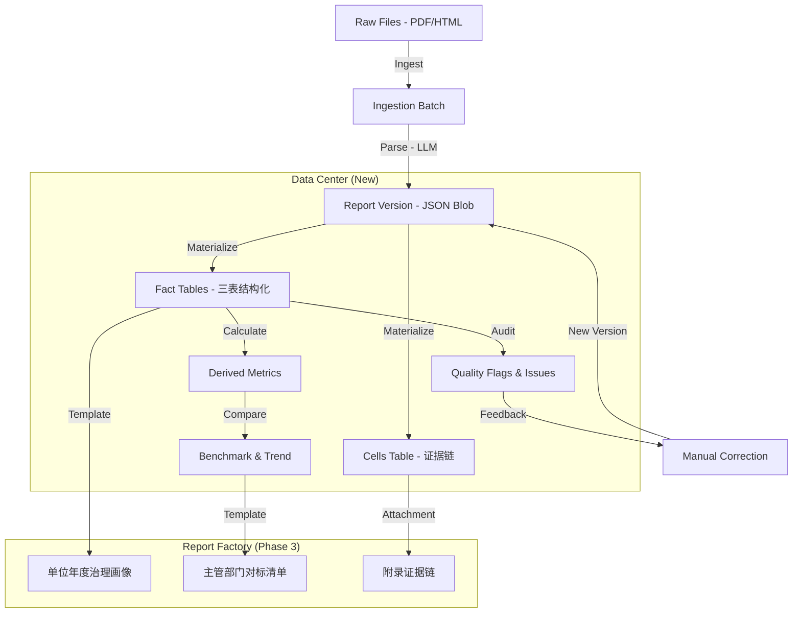

# KIROGOVCOMPARE Data Center Renovation Plan v2.2.3

**Version**: 2.2.3 (Full 合并版 — 可单文件交付)  
**Date**: 2026-01-13  
**Scope**: 政务公开年报三张标准表（主动公开 / 依申请 / 复议诉讼）数据中心建设

---

## Diff Summary（版本演进摘要）

### v2.1 新增内容块
1. **§5. 指标字典**：口径资产管理、版本化治理机制、发布流程
2. **§4.3 Cells 语义规范**：`0/空/不适用` 语义区分（`value_semantic` enum）
3. **§8. 页面/功能规划**：Data Center UI 最小信息架构
4. **§6. 批次导入**：`ingestion_batches` 表结构
5. **§10. 报告工厂**：两类报告模板与 AI 边界
6. **§11. 验收与回归测试**：版本留痕、materialize 幂等、质量规则集、金标回归集

### v2.2 修订点
1. Phase 2 验收标准改为三表聚合指标示例
2. QR-002 规则表达式明确字段白名单
3. API 路径参数统一（`:reportId`/`:versionId`）
4. 版本留痕元数据字段补充
5. 产品服务输出周期说明

### v2.2.1 修订点
1. 批次命名解耦（`batch_uuid` + `ingestion_batch_id`）
2. 指标字典唯一键改为 `(metric_key, version)`
3. 版本生效机制统一（删除 `is_active` 冗余）
4. DDL 兼容性类型映射原则

### v2.2.2 修订点
1. 指标字典部分唯一索引（PG）
2. Phase 1 双库 Migration 交付规范

### v2.2.3 修订点（本版本）
1. **source_table 枚举封口**：仅允许 `'facts'|'derived'`，禁止 cells 直算
2. **SQLite DDL 类型禁用清单**：禁止 PG 专有类型
3. **SQLite 触发器**：唯一活动版本约束
4. **metric_dictionary 双库 DDL 示例**：PG + SQLite 完整 DDL
5. **CI 静态扫描规范**：SQLite Migration 禁用关键字检测
6. **Schema 同构验收**：`schema_pg.json` vs `schema_sqlite.json` 对比规则

---

## 1. 背景与现状

### 现有系统

- **用途**：政府信息公开年度报告比对与质量审计
- **核心表**：
  - `reports`：报告主体元数据
  - `report_versions`：版本/文件（含 `parsed_json`）
  - `jobs`：异步任务队列
  - `comparisons`：年度比对结果
- **部署架构**：甲骨文云（PostgreSQL）+ 本地开发（SQLite）

### 关键痛点

| 痛点 | 描述 | 影响 |
|------|------|------|
| **版本覆盖风险** | 手工修正 `parsed_json` 直接覆盖记录 | 无法回溯、审计失效 |
| **数据结构耦合** | `parsed_json` 是大 JSON Blob | 查询性能差、无法细粒度审计 |
| **口径不统一** | 缺乏指标字典 | 报告解释不一致、难以横向对标 |
| **语义丢失** | 原值 "0"、空、"不适用" 混用 | 计算逻辑污染、证据链断裂 |

---

## 2. 改造总体目标

本次改造范围**严格冻结**为以下三部分：

### A) 版本治理（基石）

- **不可变版本**：任何对 `parsed_json` 的编辑都必须生成新的 `report_version`
- **指针管理**：`reports.active_version_id` 为唯一生效指针
- **状态机引入**：版本状态流转（`parsed` → `qa_failed` → `manual_corrected` → `customer_confirmed`）
- **前台体验**：默认展示 Current 版本，提供折叠式历史版本回溯

### B) 数据中心（核心）

围绕年报的核心"三张表"（主动公开、依申请、复议诉讼）进行数据下沉：

| 层次 | 描述 | 核心价值 |
|------|------|---------|
| **Cells（单元格层）** | OCR/LLM 解析的原始单元格数据 | 证据链溯源 |
| **Facts（事实层）** | JSON 展平为关系型数据 | 结构化查询 |
| **Derived（派生层）** | 预计算指标 | 高性能统计 |
| **Quality（质量层）** | 勾稽校验结果、异常标记 | 质量治理 |

### C) 行业壁垒（护城河）

1. **口径治理**：指标字典统一计算口径，支持版本化
2. **证据链**：Cells 语义规范，Facts 可钻取到原值
3. **质量校验与对标趋势**：勾稽恒等式、异常突变检测、分位数对标
4. **报告工厂化交付**：模板化报告生成，AI 辅助但最终结论来自显式规则

---

## 3. 总体架构

### 数据分层架构



### 数据流

1. **Ingest**: 批量上传 → 创建 `ingestion_batches` (获得 `batch_uuid`) → 逐个创建 `reports` → 触发 Parse Job
2. **Parse**: LLM 解析 → 生成 `report_versions` (JSON) → 更新 `reports.active_version_id`
3. **Materialize**: 监听 Version 变更 → 异步展平 JSON 到 `facts` 和 `cells` 表
4. **Quality Check**: 基于 `facts` 表运行 SQL 规则 → 生成 `quality_issues`
5. **Benchmark**: 基于 `derived` 表计算分位数、趋势
6. **Correction**: 用户修改数据 → 生成新 `report_version` → 触发新的 Materialize 流程
7. **Export**: 按模板生成报告 → 附加证据链与字典说明

---

## 4. 数据模型设计

### 4.1 核心表 ERD

| 表名 | 字段 | 说明 |
|------|------|------|
| **reports** | `id`, `region_id`, `year`, `unit_name`, `active_version_id` (FK), `created_at`, `updated_at` | 报告主体，`active_version_id` 为唯一生效指针 |
| **report_versions** | `id`, `report_id` (FK), `parsed_json`, `file_hash`, `parent_version_id` (FK), `version_type`, `change_reason`, `changed_fields_summary`, `state`, `created_by`, `ingestion_batch_id` (FK), `schema_version` | 版本（不可变） |
| **ingestion_batches** | `id`, `batch_uuid`, `created_by`, `note`, `status`, `created_at` | 导入批次，`batch_uuid` 对外暴露 |
| **fact_active_disclosure** | `id`, `report_id`, `version_id`, `category`, `made_count`, `processed_count`, ... | 表2: 主动公开 |
| **fact_application** | `id`, `report_id`, `version_id`, `applicant_type`, `response_type`, `count`, ... | 表3: 依申请 |
| **fact_legal_proceeding** | `id`, `report_id`, `version_id`, `type`, `result_type`, `count`, ... | 表4: 复议诉讼 |
| **quality_issues** | `id`, `report_id`, `version_id`, `rule_code`, `severity`, `description`, `cell_ref`, `auto_status`, `human_status` | 质量问题 |
| **metric_dictionary** | `id`, `metric_key`, `version`, `display_name`, `source_table`, `drilldown_source`, `deprecated_at`, ... | 指标字典 |

### 4.2 cells 表（证据链核心）

#### PostgreSQL 版本
```sql
CREATE TABLE cells (
    id              SERIAL PRIMARY KEY,
    version_id      INTEGER NOT NULL REFERENCES report_versions(id),
    table_id        TEXT NOT NULL,            -- 'active_disclosure' | 'application' | 'legal_proceeding'
    row_key         TEXT NOT NULL,
    col_key         TEXT NOT NULL,
    cell_ref        TEXT NOT NULL,            -- "{table_id}:{row_key}:{col_key}"
    value_raw       TEXT,
    value_num       NUMERIC,
    value_semantic  TEXT NOT NULL DEFAULT 'TEXT' CHECK (value_semantic IN ('ZERO','EMPTY','NA','TEXT','NUMERIC')),
    normalized_value TEXT,
    page_number     INTEGER,
    bbox_json       TEXT,
    confidence      REAL,
    created_at      TIMESTAMP DEFAULT CURRENT_TIMESTAMP,
    UNIQUE(version_id, cell_ref)
);

CREATE INDEX idx_cells_version ON cells(version_id);
CREATE INDEX idx_cells_table ON cells(version_id, table_id);
```

#### SQLite 版本
```sql
CREATE TABLE cells (
    id              INTEGER PRIMARY KEY AUTOINCREMENT,
    version_id      INTEGER NOT NULL REFERENCES report_versions(id),
    table_id        TEXT NOT NULL,
    row_key         TEXT NOT NULL,
    col_key         TEXT NOT NULL,
    cell_ref        TEXT NOT NULL,
    value_raw       TEXT,
    value_num       REAL,
    value_semantic  TEXT NOT NULL DEFAULT 'TEXT' CHECK (value_semantic IN ('ZERO','EMPTY','NA','TEXT','NUMERIC')),
    normalized_value TEXT,
    page_number     INTEGER,
    bbox_json       TEXT,
    confidence      REAL,
    created_at      TEXT DEFAULT (datetime('now')),
    UNIQUE(version_id, cell_ref)
);

CREATE INDEX idx_cells_version ON cells(version_id);
CREATE INDEX idx_cells_table ON cells(version_id, table_id);
```

### 4.3 Cells 语义规范（0/空/不适用）

| value_semantic | 含义 | value_raw 示例 | value_num | 计算规则 |
|----------------|------|----------------|-----------|----------|
| `ZERO` | 显式零值 | "0", "0件", "零" | 0 | 参与求和 |
| `EMPTY` | 空白单元格 | "", null | null | **不参与计算，标记缺失** |
| `NA` | 明确不适用 | "/", "-", "不适用" | null | **不参与计算，不算缺失** |
| `TEXT` | 非数值文本 | "详见附表" | null | 记录原文，不参与数值计算 |
| `NUMERIC` | 有效数值 | "123" | 123 | 正常参与计算 |

**核心规则**：
1. **禁止猜测性补零**：facts/derived 计算不得将 `EMPTY`/`NA` 替换为 0
2. **保留语义**：任何聚合查询必须携带语义信息或明确过滤条件
3. **可钻取**：facts 表的任何数值都能通过 `cell_ref` 追溯到 cells 原值
4. **质量指标**：统计 0/空/NA 分布，在质量页面可钻取查看

### 4.4 兼容性 DDL 原则

> **重要**：文档中的 DDL 示例以 PostgreSQL 为基准。

| PG 类型 | SQLite 映射类型 | 说明 |
|------|------|------|
| `SERIAL PRIMARY KEY` | `INTEGER PRIMARY KEY AUTOINCREMENT` | 自增主键 |
| `UUID` | `TEXT` | 存储为 UUID 格式字符串 |
| `JSONB` / `JSON` | `TEXT` | 应用逻辑完成 JSON 编解码 |
| `TIMESTAMP` | `TEXT` | 使用 `datetime('now')` |
| `NUMERIC` | `REAL` | 浮点数处理 |

> **强制约束（端到端规则）**：`migrations/sqlite/*.sql` 中 **禁止出现** 以下 PG 专有类型或表达式：
> - `SERIAL`、`BIGSERIAL`
> - `UUID`（直接作为类型）
> - `JSONB`、`JSON`
> - `TIMESTAMP`、`TIMESTAMPTZ`
> - `CURRENT_TIMESTAMP`（需改为 `datetime('now')`）

### 4.5 CI 静态扫描规范（SQLite Migration 类型检查）

**扫描范围**：仅 `migrations/sqlite/*.sql`

**扫描规则**：
1. 读取文件内容
2. 剥离 `--` 单行注释和 `/* */` 块注释
3. 按词边界匹配以下禁用关键字（大小写不敏感）：
   - `SERIAL`, `BIGSERIAL`
   - `\bUUID\b`（作为类型）
   - `JSONB`, `JSON`（作为类型）
   - `\bTIMESTAMP\b`, `TIMESTAMPTZ`
   - `CURRENT_TIMESTAMP`

**CI 失败行为**：
- 若匹配到任一禁用关键字，CI 失败
- 输出：文件名、行号、匹配到的关键字

**示例检查脚本（伪代码）**：
```python
import re

FORBIDDEN = [
    r'\bSERIAL\b', r'\bBIGSERIAL\b', r'\bUUID\b', 
    r'\bJSONB\b', r'\bJSON\b', r'\bTIMESTAMP\b', 
    r'\bTIMESTAMPTZ\b', r'\bCURRENT_TIMESTAMP\b'
]

def strip_comments(sql):
    sql = re.sub(r'--.*$', '', sql, flags=re.MULTILINE)
    sql = re.sub(r'/\*.*?\*/', '', sql, flags=re.DOTALL)
    return sql

def check_file(filepath):
    content = open(filepath).read()
    clean = strip_comments(content)
    for i, line in enumerate(clean.split('\n'), 1):
        for pattern in FORBIDDEN:
            if re.search(pattern, line, re.IGNORECASE):
                raise Exception(f"{filepath}:{i} contains forbidden: {pattern}")
```

### 4.6 迁移策略

- **Double Write**: 暂时保留 `parsed_json` 作为 Source of Truth
- **Lazy Materialization**: 部署后，后台启动任务将现有 `active` 版本的 JSON 刷入 Facts/Cells 表
- **Schema Version**: 每次表结构变更需同步更新 `report_versions.schema_version`

---

## 5. 指标字典（Metric Dictionary）

### 5.1 为什么必须做

| 需求 | 说明 |
|------|------|
| **口径统一** | 同一指标在不同地区、不同年份的计算方式必须一致 |
| **抗质疑** | 外部审计时，能够明确解释每个指标的定义、来源和计算方法 |
| **报告解释一致性** | 自动生成报告时，指标描述与数据来源需从字典动态获取 |

### 5.2 表结构设计

#### PostgreSQL 版本
```sql
CREATE TABLE metric_dictionary (
    id                  SERIAL PRIMARY KEY,
    metric_key          TEXT NOT NULL,
    version             INTEGER NOT NULL DEFAULT 1,
    display_name        TEXT NOT NULL,
    description         TEXT,
    unit                TEXT DEFAULT '件',
    aggregatable        BOOLEAN DEFAULT TRUE,
    formula_sql_or_expr TEXT,
    
    -- 计算来源：仅允许 'facts' 或 'derived'，禁止直接从 cells 计算
    source_table        TEXT NOT NULL CHECK (source_table IN ('facts', 'derived')),
    source_column       TEXT,
    dims_supported      TEXT,
    
    -- 证据链来源：用于声明该指标可钻取到 cells 原值
    drilldown_source    TEXT DEFAULT NULL CHECK (drilldown_source IS NULL OR drilldown_source = 'cells'),
    
    caveats             TEXT,
    interpretation_template TEXT,
    effective_from      DATE,
    deprecated_at       TIMESTAMP,
    superseded_by       TEXT,
    created_at          TIMESTAMP DEFAULT CURRENT_TIMESTAMP,
    updated_at          TIMESTAMP DEFAULT CURRENT_TIMESTAMP,
    
    UNIQUE(metric_key, version)
);

-- 强制唯一活动版本（部分唯一索引）
CREATE UNIQUE INDEX idx_metric_dict_active_unique 
    ON metric_dictionary(metric_key) 
    WHERE deprecated_at IS NULL;
```

#### SQLite 版本
```sql
CREATE TABLE metric_dictionary (
    id                  INTEGER PRIMARY KEY AUTOINCREMENT,
    metric_key          TEXT NOT NULL,
    version             INTEGER NOT NULL DEFAULT 1,
    display_name        TEXT NOT NULL,
    description         TEXT,
    unit                TEXT DEFAULT '件',
    aggregatable        INTEGER DEFAULT 1,
    formula_sql_or_expr TEXT,
    
    -- 计算来源：仅允许 'facts' 或 'derived'
    source_table        TEXT NOT NULL CHECK (source_table IN ('facts', 'derived')),
    source_column       TEXT,
    dims_supported      TEXT,
    
    -- 证据链来源
    drilldown_source    TEXT DEFAULT NULL CHECK (drilldown_source IS NULL OR drilldown_source = 'cells'),
    
    caveats             TEXT,
    interpretation_template TEXT,
    effective_from      TEXT,
    deprecated_at       TEXT,
    superseded_by       TEXT,
    created_at          TEXT DEFAULT (datetime('now')),
    updated_at          TEXT DEFAULT (datetime('now')),
    
    UNIQUE(metric_key, version)
);

-- SQLite 触发器：强制唯一活动版本
CREATE TRIGGER trg_metric_dict_single_active
BEFORE INSERT ON metric_dictionary
FOR EACH ROW
WHEN NEW.deprecated_at IS NULL
BEGIN
    SELECT RAISE(ABORT, 'metric_key already has an active version')
    WHERE EXISTS (
        SELECT 1 FROM metric_dictionary
        WHERE metric_key = NEW.metric_key AND deprecated_at IS NULL
    );
END;

-- UPDATE 触发器（防止通过 UPDATE 创建多活动版本）
CREATE TRIGGER trg_metric_dict_single_active_update
BEFORE UPDATE ON metric_dictionary
FOR EACH ROW
WHEN NEW.deprecated_at IS NULL AND OLD.deprecated_at IS NOT NULL
BEGIN
    SELECT RAISE(ABORT, 'metric_key already has an active version')
    WHERE EXISTS (
        SELECT 1 FROM metric_dictionary
        WHERE metric_key = NEW.metric_key AND deprecated_at IS NULL AND id != NEW.id
    );
END;
```

### 5.3 source_table 封口规则（端到端）

> **关键约束**：所有统计/对标/趋势类指标必须基于结构化事实数据计算。

| 规则 | 说明 |
|------|------|
| `source_table` 仅允许 `'facts'` \| `'derived'` | 禁止任何"cells/JSON 直算指标"路径 |
| `drilldown_source = 'cells'` | 仅用于声明"前端可提供下钻到原始单元格"的能力 |
| 证据下钻路径 | `GET /api/v2/reports/:reportId/cells` |

### 5.4 示例数据（三表相关）

| metric_key | display_name | source_table | drilldown_source | caveats |
|------------|--------------|--------------|------------------|---------|
| `active_disclosure_total` | 主动公开总数 | facts | cells | 部分地区将"规范性文件"与"规章"合并 |
| `application_received_total` | 依申请收到总数 | facts | cells | 注意区分"本年新收"与"上年结转" |
| `application_response_rate` | 依申请答复率 | derived | cells | 若收到数为 0，标记为 NA 而非 100% |
| `legal_maintain_rate` | 复议诉讼维持率 | derived | cells | 仅计算有结案的复议/诉讼 |

### 5.5 口径治理机制

1. **版本递增**：变更同一 `metric_key` 时，必须插入新行并递增 `version`
2. **活动标记**：插入新版本时，旧版本的 `deprecated_at` 必须同步更新
3. **追溯性**：报告生成时，必须关联具体的 `metric_dictionary.id` (Row ID)

### 5.6 唯一活动版本验收

| 数据库 | 验收方法 |
|--------|----------|
| **PostgreSQL** | 尝试插入第二条同 `metric_key` 且 `deprecated_at IS NULL` 的记录 → 唯一索引报错 |
| **SQLite** | 尝试插入第二条同 `metric_key` 且 `deprecated_at IS NULL` 的记录 → 触发器 ABORT |

**验收步骤**：
1. 插入 `metric_key='test_key', deprecated_at=NULL`（应成功）
2. 再次插入 `metric_key='test_key', deprecated_at=NULL`（应失败）
3. 插入 `metric_key='test_key', deprecated_at='2026-01-01'`（应成功，允许历史版本共存）

---

## 6. 批次导入（Ingestion Batches）

### 6.1 表结构设计

#### PostgreSQL 版本
```sql
CREATE TABLE ingestion_batches (
    id              SERIAL PRIMARY KEY,
    batch_uuid      UUID NOT NULL UNIQUE,
    created_by      INTEGER REFERENCES users(id),
    created_at      TIMESTAMP DEFAULT CURRENT_TIMESTAMP,
    source          TEXT DEFAULT 'upload',
    note            TEXT,
    report_count    INTEGER DEFAULT 0,
    success_count   INTEGER DEFAULT 0,
    fail_count      INTEGER DEFAULT 0,
    status          TEXT DEFAULT 'processing',
    completed_at    TIMESTAMP
);

CREATE INDEX idx_batch_created ON ingestion_batches(created_at DESC);
CREATE INDEX idx_batch_status ON ingestion_batches(status);
```

#### SQLite 版本
```sql
CREATE TABLE ingestion_batches (
    id              INTEGER PRIMARY KEY AUTOINCREMENT,
    batch_uuid      TEXT NOT NULL UNIQUE,
    created_by      INTEGER,
    created_at      TEXT DEFAULT (datetime('now')),
    source          TEXT DEFAULT 'upload',
    note            TEXT,
    report_count    INTEGER DEFAULT 0,
    success_count   INTEGER DEFAULT 0,
    fail_count      INTEGER DEFAULT 0,
    status          TEXT DEFAULT 'processing',
    completed_at    TEXT
);

CREATE INDEX idx_batch_created ON ingestion_batches(created_at DESC);
CREATE INDEX idx_batch_status ON ingestion_batches(status);
```

### 6.2 关联设计

- **jobs/report_versions**：增加字段 `ingestion_batch_id INTEGER REFERENCES ingestion_batches(id)`
- **命名规范**：禁止使用 `batch_id` 命名外键，一律使用 `ingestion_batch_id`

### 6.3 功能要求

1. **可观测**：Overview 以 batch 聚合展示
2. **可回溯**：点击批次可展开查看所有关联的 jobs 和 reports
3. **支持重跑**：对失败的 jobs 提供批量重试（通过 API）

### 6.4 批次回滚（管理员运维工具）

> **定位**：按 batch 回滚为**管理员运维脚本**，不作为产品功能 API 暴露。

**回滚动作**：
1. 将该 batch 关联的所有 `report_versions` 标记为 `state='rolled_back'`
2. 删除该 batch 关联的所有 `facts_*` 和 `cells` 记录
3. 将相关 `reports.active_version_id` 回退到上一有效版本（若无则置空）
4. 记录操作日志（操作人、时间、batch_uuid、影响报告数）

**验收方法**：
1. 执行回滚脚本后，查询 `report_versions WHERE ingestion_batch_id = ?` 应全部为 `rolled_back`
2. 查询 `cells/facts_* WHERE version_id IN (...)` 应返回空
3. 相关报告的 `active_version_id` 应指向回滚前的版本或为 NULL

**脚本路径**：`scripts/batch_rollback.ts`（Phase 1 交付）

---

## 7. 任务编排（Job System）

扩展 `jobs` 表 `kind` 字段：

| Job Kind | 触发条件 | 行为 | 幂等/重试 |
|----------|----------|------|-----------|
| `parse` | 文件上传/重新解析 | 调用 LLM，生成 Version | 幂等 (Hash check) |
| `materialize` | Version 创建/激活 | JSON → SQL Insert | 需先清空该 Version 的旧 Facts |
| `quality_check` | Materialize 完成 | 运行 SQL 校验规则 | 幂等 (Delete-Insert) |
| `benchmark_calc` | Derived 完成 | 计算分位数/排名 | 幂等 |

**任务依赖链**：`parse → materialize → quality_check → benchmark_calc`

---

## 8. 页面/功能规划（Data Center UI）

### 8.1 Overview（运行态 + 数据覆盖 + 质量）

| 模块 | 内容 |
|------|------|
| **导入批次** | 最近 5 批次：批次ID、时间、报告数、成功率 |
| **解析成功率** | 总体成功率、近 7 天趋势 |
| **失败原因 Top** | Top 5 失败原因分布（饼图） |
| **质量通过率** | 勾稽校验通过率、近 7 天趋势 |
| **异常数量** | 待处理问题数、按严重程度分布 |

### 8.2 Facts（三表指标）

- **API 参数限制**：`tableName` 必须在白名单范围内，严禁动态拼接非受控字符串。

- **tableName 白名单（显式枚举）**：

| API 参数值 | 映射物理表名 | 说明 |
|-----------|-------------|------|
| `active_disclosure` | `fact_active_disclosure` | 主动公开事实数据 |
| `application` | `fact_application` | 依申请事实数据 |
| `legal_proceeding` | `fact_legal_proceeding` | 复议诉讼事实数据 |

- **实现约束**：后端路由处理函数必须通过硬编码映射表转换 `tableName`，禁止字符串模板拼接或 ORM 动态表名。

**后端实现示例**：
```typescript
const TABLE_MAP: Record<string, string> = {
  'active_disclosure': 'fact_active_disclosure',
  'application': 'fact_application',
  'legal_proceeding': 'fact_legal_proceeding'
};

function getTableName(tableName: string): string {
  const mapped = TABLE_MAP[tableName];
  if (!mapped) {
    throw new Error(`Invalid tableName: ${tableName}`);
  }
  return mapped;
}
```

### 8.3 Benchmark & Trend（同类对标与趋势）

| 功能 | 说明 |
|------|------|
| **同类单位分位数** | P25 / P50 / P75 分位数线 |
| **排名** | 当前单位在同类中的排名（百分位） |
| **近 3-5 年趋势** | 折线图展示指标变化趋势 |
| **对标参照** | 可选择对标组（同省/同级/全国） |

### 8.4 Quality & Audit（质量审计）

| 功能 | 说明 |
|------|------|
| **勾稽恒等** | 恒等式校验结果列表 |
| **缺失语义** | EMPTY 单元格分布统计 |
| **异常突变** | 同比突变超阈值的指标列表 |
| **可钻取** | 点击问题项 → 跳转到对应 cells 原值 |
| **人工复核** | 支持标记"已确认无误"或"需修正" |

### 8.5 Drill-down（数据下钻）

```
Facts/Derived 指标值
    ↓ 点击
  Cells 原值（GET /api/v2/reports/:reportId/cells）
    ↓ 可选扩展
  parsed_json 原文位置（预留）
```

### 8.6 Export（导出）

| Phase | 功能 |
|-------|------|
| **Phase 1** | CSV 导出（Facts 表结构化数据） |
| **Phase 3** | 报告导出（单位画像报告 / 主管部门对标清单） |

---

## 9. API 清单

> 所有数据读取默认基于 Current Version

### Data Center API

| Method | Path | Description |
|--------|------|-------------|
| GET | `/api/v2/reports/:reportId/facts/:tableName` | `tableName` ∈ {`active_disclosure`, `application`, `legal_proceeding`} |
| GET | `/api/v2/reports/:reportId/cells` | 获取单元格原值（证据链钻取） |
| GET | `/api/v2/reports/:reportId/quality` | 获取质量审计结果 |
| GET | `/api/v2/stats/trend` | 跨年/跨区域趋势数据 |
| GET | `/api/v2/stats/benchmark` | 分位数对标数据 |
| GET | `/api/v2/batches` | 获取批次列表 |
| GET | `/api/v2/batches/:batchUuid` | 获取批次详情（通过 UUID 查询） |
| POST | `/api/v2/batches/:batchUuid/retry` | 重试该批次中的失败任务 |
| GET | `/api/v2/metrics` | 获取指标字典列表 |
| GET | `/api/v2/metrics/:metricKey` | 获取指标详情 |

### Version Control API

| Method | Path | Description |
|--------|------|-------------|
| GET | `/api/v1/reports/:reportId/versions` | 版本列表 |
| POST | `/api/v1/reports/:reportId/versions/:versionId/activate` | 激活指定版本 |
| GET | `/api/v1/reports/:reportId/versions/:versionId/diff` | 版本差异对比 |

---

## 10. 报告工厂（Report Factory）

### 10.1 模块定位

将 Phase 3 的"报告导出"升级为**产品化报告工厂模块**，实现：
- **模板化**：预定义报告结构，数据动态填充
- **可追溯**：数据来源映射明确，附录证据链
- **AI 辅助**：AI 生成解释与建议草稿，最终结论来自显式规则

### 10.2 报告模板

#### A) 单位年度治理画像报告

| 章节 | 内容 | 数据来源 |
|------|------|----------|
| **执行摘要** | 本年度主要指标概览、同比变化、风险提示 | derived + benchmark |
| **方法与口径** | 本报告使用的指标定义与计算方法 | metric_dictionary |
| **三表画像** | 主动公开 / 依申请 / 复议诉讼 详细数据表格 | facts |
| **对标趋势** | 与同类单位对标、近 3-5 年趋势图 | benchmark + derived |
| **整改路线图** | 基于质量问题的整改建议（AI 草稿 + 人工确认） | quality_issues |
| **附录** | 指标定义 + cells 原值溯源 | metric_dictionary + cells |

#### B) 主管部门年度对标与风险清单

| 章节 | 内容 | 数据来源 |
|------|------|----------|
| **全域态势** | 辖区内所有单位整体情况概览 | facts 聚合 |
| **风险 TopN** | 按风险程度排序的单位清单 | quality_issues 聚合 |
| **分位数对标** | 各单位在 P25/P50/P75 的分布 | benchmark |
| **典型问题库** | 常见问题归类与典型案例 | quality_issues 分类 |
| **督导建议** | 针对问题的督导措施建议 | AI 生成 |

### 10.3 AI 边界声明

> **重要**：AI 仅用于"解释与建议草稿"，最终结论必须来自**显式规则与计算**（可审计）

| 场景 | AI 角色 | 人工角色 |
|------|---------|----------|
| 指标解读 | 生成自然语言解释草稿 | 审核并修改 |
| 风险识别 | 基于规则计算，AI 不参与 | 确认规则设置 |
| 整改建议 | 生成建议草稿 | 审核、修改、确认 |
| 数值计算 | **禁止**：所有数值必须来自 SQL/代码 | N/A |

### 10.4 产品服务输出周期

| 维度 | 说明 |
|------|------|
| **数据更新周期** | 年报数据**年更**（通常每年 3-4 月集中入库上一年度报告） |
| **产品服务周期** | 可按**月/季**输出增值服务，但输出内容必须**严格基于三表数据与质量标签** |

**可输出的月/季产品服务**：

| 服务类型 | 内容 | 数据来源 |
|----------|------|----------|
| **对标简报** | 本单位与同类单位的分位数排名变化 | benchmark + derived |
| **风险预警** | 质量问题未整改清单、逾期提醒 | quality_issues |
| **整改闭环跟踪** | 已标记整改的问题进度更新 | quality_issues + 人工复核记录 |

**明确排除范围**：
- ❌ 网站栏目可用性监测
- ❌ 实时舆情监控
- ❌ 非年报三表的其他政务公开数据

---

## 11. 验收与回归测试

### 11.1 版本留痕验收

#### 版本元数据字段

| 字段 | 类型 | 说明 |
|------|------|------|
| `version_type` | TEXT | `original_parse` / `manual_correct` / `reparse` |
| `parent_version_id` | INTEGER FK | 指向父版本，形成版本链 |
| `change_reason` | TEXT | 变更原因描述 |
| `changed_fields_summary` | TEXT/JSON | 变更字段摘要 |

#### 验收项

| 验收项 | 预期行为 | 验收方法 |
|--------|----------|----------|
| **编辑生成新版本** | 编辑后必须生成新 report_version | versions 列表数量+1 |
| **内容幂等复用** | 相同 file_hash 重复提交复用已有 | version_id 不变 |
| **current 指针正确** | `active_version_id` 始终指向生效版本 | 激活旧版本后检查指针 |
| **历史版本只读** | 非 current 版本不可编辑 | 尝试编辑旧版本返回 403 |

### 11.2 Materialize 幂等

| 验收项 | 预期行为 | 验收方法 |
|--------|----------|----------|
| **同 version 重跑不重复** | 重跑 materialize 不产生重复 | COUNT(*) 不变 |
| **可重试** | 失败后可重试，成功后状态正确 | 模拟中断后重试 |
| **失败回滚** | 失败时回滚该 version 的所有 facts/cells | 检查失败后无残留数据 |

### 11.3 指标字典约束验收

| 验收项 | 预期行为 | 验收方法 |
|--------|----------|----------|
| **source_table 枚举校验** | `source_table='cells'` 应被拒绝 | CHECK 约束报错 |
| **drilldown_source 合法值** | `drilldown_source='invalid'` 应被拒绝 | CHECK 约束报错 |
| **drilldown_source 允许 NULL** | `drilldown_source=NULL` 应被接受 | INSERT 成功 |
| **drilldown_source 允许 'cells'** | `drilldown_source='cells'` 应被接受 | INSERT 成功 |
| **唯一活动版本 (PG)** | 同 key 第二条活动记录被拒绝 | 唯一索引报错 |
| **唯一活动版本 (SQLite)** | 同 key 第二条活动记录被拒绝 | 触发器 ABORT |

### 11.4 质量规则最小集（≥10 条）

| 规则编号 | 规则名称 | 规则表达式 | 严重程度 |
|----------|----------|------------|----------|
| QR-001 | 依申请收办守恒 | `新收 + 上年结转 = 办结 + 结转下年` | CRITICAL |
| QR-002 | 答复方式合计 | `Σ(reply_*) = 答复总数`（字段：`reply_public`, `reply_partial`, `reply_reject`, `reply_not_exist`, `reply_not_scope`, `reply_other`） | CRITICAL |
| QR-003 | 复议结果合计 | `维持 + 纠正 + 其他 = 复议结案总数` | CRITICAL |
| QR-004 | 诉讼结果合计 | `维持 + 纠正 + 其他 = 诉讼结案总数` | CRITICAL |
| QR-005 | 主动公开分项合计 | `各分类加总 = 主动公开总数` | HIGH |
| QR-006 | 数值非负 | `所有 count 类字段 >= 0` | HIGH |
| QR-007 | 同比突变检测 | `本年/上年 > 5 或 < 0.2 时标记` | MEDIUM |
| QR-008 | 缺失值检测 | `value_semantic = 'EMPTY' 的关键字段` | MEDIUM |
| QR-009 | 零值异常 | `关键指标为 0 但同类平均值 > 100` | MEDIUM |
| QR-010 | 文本值检测 | `value_semantic = 'TEXT' 的数值字段` | LOW |
| QR-011 | NA 合理性 | `value_semantic = 'NA' 但同类单位有数值` | LOW |
| QR-012 | 百分比范围 | `比率类指标应在 0-100% 之间` | LOW |

### 11.5 金标回归集

**目的**：model/prompt 变更时必须回归对比输出差异

**样本选取原则**：
- 覆盖"三表"不同复杂度
- 覆盖不同地区（省级/市级/区县级）
- 覆盖不同年份（至少 2 年）
- 覆盖已知 edge case（跨页表格、合并单元格、扫描件）

**固定样本数量**：≥ 10 份（建议 20 份）

**回归流程**：
1. 对金标样本运行新 model/prompt
2. 与上一版本输出进行 diff
3. 生成变更报告：新增字段、缺失字段、数值变化
4. **阻塞标准**：任何金标样本的 critical 字段变化需人工审批

---

## 12. 里程碑与排期

### Phase 0: 版本治理（已完成）

- [x] Schema: `report_versions` 留痕
- [x] API: Edit → New Version
- [x] UI: 版本列表与切换

**交付物清单**：
| 交付物 | 状态 |
|--------|------|
| 迁移脚本 `migrations/xxx_version_tracking.sql` | ✅ 已实现 |
| API 接口 `/api/v1/reports/:reportId/versions` | ✅ 已实现 |
| 前端版本切换器组件 | ✅ 已实现 |

---

### Phase 1: 数据下沉（Materialize）

- [ ] Schema: 创建 Fact 表 + Cells 表 + ingestion_batches 表 + metric_dictionary 表
- [ ] Backend: 实现 JSON → SQL 转换逻辑（含 cells 语义解析）
- [ ] Job: 实现 `materialize` 任务与触发器
- [ ] Backend: 实现批次导入逻辑

**交付物清单**：
| 交付物 | 验收条件 |
|--------|----------|
| `migrations/pg/*.sql` | PG 可执行 |
| `migrations/sqlite/*.sql` | SQLite 可执行，无 PG 专有类型 |
| `src/services/MaterializeService.ts` | 单元测试覆盖率 ≥80% |
| `metric_dictionary` seed 数据 | ≥10 条三表相关指标 |

**双库 Migration 交付规范**：
- 必须同时提供 `migrations/pg/*.sql` 与 `migrations/sqlite/*.sql`
- 或提供基于抽象层的双库兼容生成脚本
- **严禁**：在 SQLite Migration 中出现 PG 专有类型

**验收标准**：
- Facts/Cells 表有数据，且与 JSON 内容一致
- Cells 表正确区分 value_semantic（手工抽检 ≥20 条）
- CI 通过双库 Schema 同构验收

---

### Phase 2: 质量与统计 API

- [ ] Backend: 实现 quality_check 任务
- [ ] Backend: 实现 benchmark_calc 任务
- [ ] API: 提供高性能的统计聚合接口
- [ ] UI: 数据中心看板 MVP

**实现原则**：
- Derived/Benchmark 允许在 Phase 2 采用数据库视图（View）或物化视图快速落地
- API 返回的数据必须支持索引优化，且计算口径符合指标字典定义

**验收标准**：
- 能够快速查询三表聚合指标示例：
  - 全市依申请本年新收总计
  - 全市依申请办结总计
  - 全市复议纠正率 P25/P50/P75 分位数
  - 全市诉讼纠正率超阈值预警名单
- 勾稽校验规则 ≥10 条可运行
- 质量问题可钻取到 cells 原值

---

### Phase 3: 产品化完善

- [ ] UI: 趋势图表、Benchmark 可视化
- [ ] Backend: 报告工厂模块
- [ ] Export: 单位画像报告 + 主管部门对标清单
- [ ] Permission: 细粒度权限控制
- [ ] Migration: 存量数据全量清洗

---

## 13. Schema 同构验收

### 13.1 验收目标

确保 PG 与 SQLite 两套 Migration 产出的表结构语义一致。

### 13.2 schema.json 输出结构

每张表输出以下字段：
```json
{
  "table_name": "metric_dictionary",
  "columns": [
    {
      "name": "id",
      "type": "SERIAL | INTEGER",
      "nullable": false,
      "primary_key": true
    },
    {
      "name": "metric_key",
      "type": "TEXT",
      "nullable": false
    },
    {
      "name": "source_table",
      "type": "TEXT",
      "nullable": false,
      "checks": ["source_table IN ('facts', 'derived')"]
    },
    {
      "name": "drilldown_source",
      "type": "TEXT",
      "nullable": true,
      "checks": ["drilldown_source IS NULL OR drilldown_source = 'cells'"]
    }
  ],
  "unique_constraints": [
    ["metric_key", "version"]
  ],
  "behavioral_constraints": [
    {
      "name": "unique_active_version",
      "description": "Each metric_key can have at most one row with deprecated_at IS NULL",
      "pg_implementation": "UNIQUE INDEX WHERE deprecated_at IS NULL",
      "sqlite_implementation": "BEFORE INSERT/UPDATE TRIGGER",
      "validation": "Validated via behavioral test cases in section 11.3"
    }
  ]
}
```

### 13.3 允许差异白名单（语义一致验收）

> **原则**：PG 与 SQLite 的验收标准聚焦于"语义一致"，而非"实现方式完全相同"。

| 差异类型 | 是否允许 | 说明 |
|----------|----------|------|
| 类型名差异 | ✅ 允许 | `SERIAL` vs `INTEGER`，`TIMESTAMP` vs `TEXT` |
| 字段缺失 | ❌ 不允许 | 必须完全一致 |
| NOT NULL 缺失 | ❌ 不允许 | 必须完全一致 |
| UNIQUE 约束缺失 | ❌ 不允许 | 必须完全一致 |
| CHECK 约束缺失 | ❌ 不允许 | 必须完全一致 |
| 普通索引差异 | ✅ 允许 | 仅影响性能，不影响正确性 |
| 行为约束实现差异 | ✅ 允许 | 如"唯一活动版本"：PG 用部分唯一索引，SQLite 用触发器，通过 §11.3 行为验收用例保障 |

### 13.4 CI 验收流程

**静态验收（Schema 对比）**：
1. 分别在 PG 和 SQLite 执行 Migration
2. 导出 `schema_pg.json` 与 `schema_sqlite.json`
3. 对比两个 JSON：
   - 表名集合必须一致
   - 每张表的字段名集合必须一致
   - 每张表的 NOT NULL / UNIQUE / CHECK 约束必须一致
   - 类型差异按白名单忽略
   - 普通索引差异不作为 hard fail
4. **CI 失败时**：输出详细 diff，标明哪张表、哪个字段、什么差异

**行为验收（配合 §11.3）**：
- 对于"唯一活动版本"等行为约束，CI 必须运行 §11.3 中的验收用例
- PG 环境验证唯一索引行为，SQLite 环境验证触发器行为
- 任一环境用例失败则 CI 失败

### 13.5 目标表清单

- `reports`, `report_versions`, `jobs`, `ingestion_batches`
- `cells`, `fact_active_disclosure`, `fact_application`, `fact_legal_proceeding`
- `quality_issues`, `metric_dictionary`

---

## 14. 风险与对策总览

| 风险类别 | 风险 | 对策 |
|----------|------|------|
| **技术** | 字段命名混淆 | 区分 `*_id` (自增) 与 `*_uuid/key` (业务) |
| **技术** | 跨库 DDL 类型错误 | SQLite Migration 静态扫描 + CI 类型白名单检查 |
| **技术** | 指标从 cells 直算 | source_table CHECK 约束封口，仅允许 facts/derived |
| **技术** | Schema 不一致 | CI 双库 Schema 同构验收 |
| **业务** | 字典多活动版本 | PG 部分唯一索引 + SQLite 触发器 |
| **业务** | 口径争议 | 指标字典版本化 + 审批流程 |
| **业务** | 规则误报 | human_status 人工复核机制 |
| **运维** | 存量数据迁移 | 幂等脚本 + 先 Check 后 Write |
| **合规** | AI 建议责任 | 明确 AI 边界，最终结论来自规则 |

---

## 附录 A：术语表

| 术语 | 定义 |
|------|------|
| **三表** | 政务公开年报核心三张表：主动公开、依申请、复议诉讼 |
| **Facts** | 从 parsed_json 展平的结构化事实数据 |
| **Cells** | 原始单元格数据，保留语义和溯源信息 |
| **Derived** | 基于 Facts 预计算的派生指标 |
| **Materialize** | 将 JSON Blob 展平写入关系表的过程 |
| **Metric Dictionary** | 指标字典，定义口径、公式、解释模板 |
| **Report Factory** | 报告工厂，模板化生成分析报告 |
| **Gold Standard** | 金标回归集，用于验证 model/prompt 变更 |

---

## 附录 B：相关文档索引

| 文档 | 路径（仓库相对路径） |
|------|---------------------|
| 年报表格 Schema v1 | `fixtures/_template/annual_report_table_schema_v1.md` |
| 异步任务系统实现计划 | `.kiro/specs/implementation_plan.md` |
| API 文档 | `API.md` |
| 部署指南 | `DEPLOYMENT.md` |
| 勾稽规则规范 | `src/schemas/reconciliation_rules.md` (TBD) |

---

*文档版本：v2.2.3 (Full) | 最后更新：2026-01-13 | 作者：Data Center Team*
