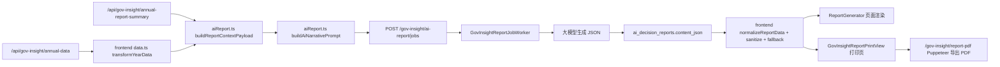
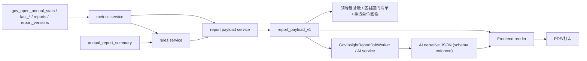

# 《aiReport.ts 指标与规则后端化拆解方案》

> 日期：2026-04-14  
> 目标：基于当前 GovInsight 正式报告链路，拆解 `frontend/src/govinsight/utils/aiReport.ts` 及相关前端规则层，明确后端化边界、统一 payload 设计和最小改造顺序。  
> 范围：本次仅做拆解与设计，不直接重写前后端业务逻辑，不先改 prompt 文案。  
> 背景参考：根目录已有更大范围的现状审计文档 `GOVINSIGHT_CURRENT_STATE_AUDIT_2026-04-14.md`，本文聚焦正式报告链路中的 `aiReport.ts` 与相关前端规则层。

---

## 一、任务结论摘要

### 1.1 一句话结论

`aiReport.ts` 目前不是“前端 prompt 工具”，而是**前端规则引擎 + 前端指标引擎 + 前端兼容层 + AI 输出修复层**的混合体。  
如果下一步要做“规则驱动 + 数据计算 + AI 成文”，第一刀不应该先改 prompt，而应该先把**指标、勾稽、风险、附件、任务骨架、层级排序**从前端迁到后端，先产出统一的 `report_payload_v1`。

### 1.2 当前正式链路的真实边界



### 1.3 核心判断

1. 当前正式报告链路的**数据计算和规则判断主要在前端**，后端 worker 主要只是“拿 prompt 调模型并存 JSON”。
2. 当前链路已经具备后端化的基础数据源：`gov_open_annual_stats`、`annual-report-summary`、`ai_decision_reports`、`gov_insight_report_jobs`。
3. 当前最危险的问题不是“没有 AI”，而是**前端假算、伪校验、存储格式混杂、版本治理缺失、层级分析仍靠名称猜测**。
4. 当前系统**适合改造成**“规则驱动 + 数据计算 + AI 成文”，但不适合直接跳到“后端批量生成正式报告”这一步；必须先补统一 payload 和版本治理。

### 1.4 当前最危险的 8 个点

| 风险点 | 现状 | 为什么危险 |
| --- | --- | --- |
| `aiReport.ts` 既算指标又拼 prompt 又修 AI 输出 | `frontend/src/govinsight/utils/aiReport.ts` | 职责混杂，无法审计、无法批量复用、无法稳定回放 |
| `accepted_total_formula` 是伪校验 | `buildMetricsSnapshot` 先算 `acceptedTotal = new + carriedOver`，`buildDataQualityStatus` 再校验同一公式 | 校验并没有验证源数据，只是在验证前端自己刚算出来的值 |
| `accepted_total_field` 也是伪校验 | `transformYearData` 先把 `totalHandled = app_new + app_carried_over`，后续又拿它和 `acceptedTotal` 比较 | 仍然是同源同公式，不是独立来源交叉校验 |
| `legalCount` 是前端假定字段 | `buildMetricsSnapshot` 用 `newReceived - naturalCount` 推导法人及其他组织数 | 如果源字段口径调整，前端会“静默修正”成另一个值 |
| 争议案件明细被前端硬置 0 | `transformYearData` 中 `maintained / other / pending` 全部设为 `0` | 下游若误用这些字段，会把“未知”当成“确为 0” |
| AI schema 约束未真正接线 | `getNarrativeResponseSchema()` 已定义，但正式链路未使用；worker 只做 `JSON.parse` | AI 输出约束实际靠 prompt 文案和前端 sanitize，缺乏后端强约束 |
| 报告存储格式混杂 | worker 存 `_reportFormat + narrative` envelope；前端保存时又直接存 `v4` 正规化报告 | 同一个 `ai_decision_reports.content_json` 存两种格式，不利于审计、迁移和历史兼容 |
| 读报告时前端会重算业务结果 | `normalizeReportData()` 会重新算 `scorecards / dataQuality / appendices`，并覆盖部分元数据 | 已保存的报告不是稳定成品，而是“渲染时再计算”的半成品 |

### 1.5 当前最重要的改造原则

1. **先把“算什么、怎么算、按什么版本算”固化到后端**。
2. **再让 AI 只负责“怎么写”**，不再负责“算”和“判”。
3. **前端只负责展示、导出、交互和轻量渲染保护**，不再承担业务规则。

---

## 二、`aiReport.ts` 功能模块全景图

### 2.1 功能模块表

| 功能块名称 | 当前代码位置 | 输入 | 输出 | 是否纯计算 | 是否依赖 UI 状态 | 是否依赖模型 | 是否建议迁后端 | 是否需要版本化 | 说明 |
| --- | --- | --- | --- | --- | --- | --- | --- | --- | --- |
| 类型定义与正式报告结构 | `frontend/src/govinsight/utils/aiReport.ts:1-260` | 无 | `EnhancedAIReportResponse` 等类型 | 否 | 否 | 否 | 部分 | 是 | 结构定义应转为前后端共享 schema；前端本地 TS 类型可保留 |
| 格式常量与规则常量 | `frontend/src/govinsight/utils/aiReport.ts:273-288` | 无 | `FORMAL_REPORT_FORMAT`、风险优先级、任务枚举 | 否 | 否 | 否 | 是 | 是 | 属于规则元数据，应该由后端规则版本管理 |
| 文本软化 / 格式化 / sanitize 基础工具 | `frontend/src/govinsight/utils/aiReport.ts:290-418` | 文本、数字 | 格式化字符串、净化字符串数组 | 部分 | 否 | 否 | 部分 | 部分 | 展示型格式化可留前端；影响业务语义的软化规则应版本化 |
| 指标快照生成 `buildMetricsSnapshot` | `frontend/src/govinsight/utils/aiReport.ts:419-523` | `AnnualData` | `ReportMetricsSnapshot` | 是 | 否 | 否 | 是 | 是 | 正式报告的核心指标引擎，应成为后端 `metrics_snapshot_v1` |
| 数据质量/勾稽校验 `buildDataQualityStatus` | `frontend/src/govinsight/utils/aiReport.ts:525-637` | `AnnualData` | `DataQualityStatus` | 是 | 否 | 否 | 是 | 是 | 属于后端可审计规则；而且当前存在伪校验问题 |
| 风险等级判断 `determineRating` | `frontend/src/govinsight/utils/aiReport.ts:639-676` | 指标快照、上年快照、数据质量 | `rating / riskLabel / reason` | 是 | 否 | 否 | 是 | 是 | 正式评级规则，必须服务化并可回放 |
| scorecards 生成 `buildScorecards` | `frontend/src/govinsight/utils/aiReport.ts:679-775` | 当前/上年快照 | `ScorecardItem[]` | 是 | 否 | 否 | 是 | 是 | 首页核心卡片属于规则输出，不应前端重算 |
| 数据预警/Top signals/同比说明 | `frontend/src/govinsight/utils/aiReport.ts:777-829` | 快照、摘要、数据质量 | `warnings / topSignals / comparisonNotes` | 部分 | 否 | 否 | 是 | 是 | 这些内容是规则化上下文，应由后端生成给前端和 AI 复用 |
| 报告上下文拼装 `buildReportContextPayload` | `frontend/src/govinsight/utils/aiReport.ts:831-860` | 当前/上年/省参考/年报摘要 | `ReportContextPayload` | 部分 | 否 | 否 | 是 | 是 | 这是当前 prompt 的真实上游，未来应升级为后端 `report_payload_v1` |
| 元数据 fallback `metadataFallback` | `frontend/src/govinsight/utils/aiReport.ts:862-897` | `ReportContextPayload` | `ReportMetadata` | 否 | 否 | 否 | 是 | 是 | 不是展示层，而是规则层的默认成文模板 |
| 总体判断规则稿 | `frontend/src/govinsight/utils/aiReport.ts:899-972` | `ReportContextPayload`、摘要 | `OverallJudgmentItem[]` | 否 | 否 | 否 | 是 | 是 | 当前是 deterministic 规则稿/fallback，应后端沉淀 |
| 风险事项默认排序与规则稿 | `frontend/src/govinsight/utils/aiReport.ts:974-1065` | `ReportContextPayload`、摘要 | `RiskItem[]` | 否 | 否 | 否 | 是 | 是 | 包含优先级、风险项骨架、排序逻辑，必须后端化 |
| 结语与 notes 规则稿 | `frontend/src/govinsight/utils/aiReport.ts:1067-1080` | `ReportContextPayload` | `closing`、`notes` | 否 | 否 | 否 | 是 | 是 | 规则性较强，属于可版本化默认文稿 |
| confirmed facts 规则稿/fallback | `frontend/src/govinsight/utils/aiReport.ts:1082-1147` | `ReportContextPayload`、摘要 | `FactGroupItem[]` | 否 | 否 | 否 | 是 | 是 | 事实层必须由规则驱动，且要受数据质量开关控制 |
| prudent analyses 规则稿/fallback | `frontend/src/govinsight/utils/aiReport.ts:1149-1204` | `ReportContextPayload`、摘要 | `PrudentAnalysisItem[]` | 否 | 否 | 否 | 是 | 是 | 可作为 AI fallback，也可作为后端提示稿 |
| unanswered questions 规则稿/fallback | `frontend/src/govinsight/utils/aiReport.ts:1206-1242` | 无 | `UnansweredQuestionItem[]` | 否 | 否 | 否 | 是 | 是 | 当前是静态规则稿，且已暴露区县/部门未接入问题 |
| rectification tasks 规则稿/fallback | `frontend/src/govinsight/utils/aiReport.ts:1244-1366` | 无 | `RectificationTaskItem[]` | 否 | 否 | 否 | 是 | 是 | 任务骨架目前硬编码且偏市级，必须后端参数化 |
| 附件一/二/三生成 | `frontend/src/govinsight/utils/aiReport.ts:1368-1529` | `ReportContextPayload` | `ReportAppendices` | 否 | 否 | 否 | 是 | 是 | 附件应完全规则化，不应由前端掌握权威逻辑 |
| prompt 上下文拼装 `buildAiNarrativePrompt` | `frontend/src/govinsight/utils/aiReport.ts:1536-1587` | `ReportContextPayload` | prompt 文本 | 否 | 否 | 是 | 是 | 是 | 批量生成、版本治理和审计要求其迁后端 |
| AI 输出 schema 定义 `getNarrativeResponseSchema` | `frontend/src/govinsight/utils/aiReport.ts:1589-1712` | 无 | JSON schema 对象 | 否 | 否 | 是 | 是 | 是 | 当前已定义但未接线，未来应进入后端模型调用层 |
| normalize / sanitize / fallback | `frontend/src/govinsight/utils/aiReport.ts:1714-1884` | AI/存储返回内容 + fallback | 清洗后的各章节数据 | 否 | 否 | 间接 | 部分 | 是 | 前端可保留渲染防御，但业务 fallback 应移后端 |
| 格式识别与兼容判定 | `frontend/src/govinsight/utils/aiReport.ts:1886-1926` | `content_json` | envelope/v3/v4/legacy 判断 | 否 | 否 | 否 | 是 | 是 | 当前兼容层说明存储协议不稳定，应由后端统一 |
| 规则报告整包生成 `buildRuleBasedEnhancedReport` | `frontend/src/govinsight/utils/aiReport.ts:1928-1953` | `EntityProfile`、year、摘要 | 完整规则报告 `v4` | 否 | 否 | 否 | 是 | 是 | 实际上是“前端 fallback 报告工厂” |
| AI narrative 合成完整报告 `buildEnhancedReportFromNarrative` | `frontend/src/govinsight/utils/aiReport.ts:1955-1988` | narrative + 当前数据 + fallback | 完整 `v4` 报告 | 否 | 否 | 间接 | 是 | 是 | 当前由前端完成“模型输出 + 规则骨架”拼接 |
| 报告归一化 `normalizeReportData` | `frontend/src/govinsight/utils/aiReport.ts:1990-2035` | 云端内容/缓存/旧格式 | 统一 `v4` 报告 | 否 | 否 | 间接 | 部分 | 是 | 轻量 shape 兼容可留前端；业务重算不应留前端 |
| 存储格式 accessor `getFormalReportStorageFormat` | `frontend/src/govinsight/utils/aiReport.ts:2037` | 无 | `FORMAL_REPORT_FORMAT` | 否 | 否 | 否 | 是 | 是 | 当前搜索范围内未见正式使用，说明协议治理未闭环 |

### 2.2 与 `aiReport.ts` 直接耦合的前端/后端文件

| 文件 | 当前作用 | 与后端化的关系 |
| --- | --- | --- |
| `frontend/src/govinsight/views/ReportGenerator.tsx` | 读取数据、构建 `reportContext`、创建 AI 任务、渲染页面、打印导出前保存 | 当前把业务链路启动点放在前端；后续应改为消费后端 payload |
| `frontend/src/components/print/GovInsightReportPrintView.tsx` | 打印页再次拉取数据并再次 `normalize/fallback` | 当前打印页也重复依赖前端规则；后续应直接消费稳定 payload/report result |
| `frontend/src/govinsight/data.ts` | 将 `/annual-data` 转为 `AnnualData`，并带有 legacy 兼容 | 是前端假算与 legacy 兜底的重要来源 |
| `frontend/src/govinsight/api.ts` | 访问 `annual-data`、`annual-report-summary`、`ai-report` | 将来需要新增 `report-payload` / `report-rules` 接口 |
| `src/routes/gov-insight.ts` | 提供原始统计、摘要、AI 报告任务与保存/读取 | 当前不生产正式规则 payload，改造重点入口 |
| `src/services/GovInsightReportJobWorker.ts` | 调模型、存 narrative envelope | 当前不掌握规则；未来应掌握 payload + schema + 版本 |
| `src/routes/ai.ts` | 通用 AI 生成路由，支持 `responseSchema` | 说明基础设施能支持 schema，但 GovInsight 正式链路尚未用起来 |

### 2.3 四类逻辑的当前归属与未来边界

| 逻辑类别 | 当前代码 | 当前归属 | 未来归属 | 结论 |
| --- | --- | --- | --- | --- |
| 数据计算逻辑 | 指标、同比、占比、率值、聚合、排序分母分子 | 前端 `aiReport.ts` + `leader-cockpit/selectors.ts` | 后端 metrics service | 必须后端化 |
| 规则逻辑 | 勾稽、数据质量、风险等级、风险标签、附件、任务骨架、默认优先级 | 前端 `aiReport.ts` + `leader-cockpit/riskPolicy.ts` | 后端 rules service | 必须后端化 |
| 展示逻辑 | 页面编排、分栏、打印 CSS、按钮状态、导出行为 | `ReportGenerator.tsx`、`GovInsightReportPrintView.tsx` | 前端 | 可暂留前端 |
| AI 成文逻辑 | 总体判断润色、风险阐释、审慎表达、结语、单位短评 | 当前由模型承担，但输入上下文由前端拼装 | 后端 AI service + 模型 | 必须保留给 AI，但输入和 schema 要后端化 |

### 2.4 当前链路中“看起来像规则，实际上是前端 fallback”的内容

1. 总体判断、风险事项、事实层、审慎分析、未回答问题、整改任务、结语、notes，当前都存在**前端规则稿/fallback**。
2. AI 不是直接输出完整正式报告；前端会用 fallback 兜底，并在部分字段上覆盖/重算。
3. 这意味着当前正式报告其实是“**前端规则报告 + AI 改写/补写**”，而不是“后端权威规则 + AI 成文”。

---

## 三、当前前端规则层输入来源分析

### 3.1 输入来源总表

| 来源类别 | 当前来源 | 具体字段/内容 | 进入前端规则层的方式 | 风险判断 |
| --- | --- | --- | --- | --- |
| 后端 API 原始统计 | `/api/gov-insight/annual-data` | `reg_*`、`doc_*`、`action_*`、`fees_amount`、`app_*`、`outcome_*`、`rev_*`、`lit_*` | `frontend/src/govinsight/api.ts` -> `data.ts::transformYearData` | 是正式输入，但只提供原子数，不提供正式指标/规则结果 |
| 后端 API 年报摘要 | `/api/gov-insight/annual-report-summary` | `highlights`、`problemSnippets`、`sections.*` | `ReportGenerator.tsx`/打印页加载后传给 `aiReport.ts` | 可用，但只是摘要，不是结构化规则结果 |
| 已存 AI 报告 | `/api/gov-insight/ai-report` | `content_json`、`model_used`、`updated_at` | `normalizeReportData()` 读入并做兼容/净化/补全 | 存储格式不统一，读取时仍依赖当前前端数据重算 |
| 前端二次派生 | `data.ts` | `totalHandled`、`sources.legal`、争议案件 `maintained/other/pending=0` | `transformYearData()` | 存在前端假算/前端补零 |
| 前端二次派生 | `aiReport.ts` | `acceptedTotal`、`resolvedTotal`、各种 rate/share、`overallCorrectionRate`、`topSignals`、`dataWarnings` | `buildMetricsSnapshot()` / `buildDataQualityStatus()` / `buildReportContextPayload()` | 是当前正式规则核心，但不在后端 |
| 前端二次派生 | `leader-cockpit/selectors.ts` | `acceptedTotal`、`disclosureRate`、`correctionRate`、排名、P90/P10 gap | `buildEntityComparisonModel()` | 与正式报告指标口径并行，后续易分叉 |
| legacy 兜底 | `frontend/src/govinsight/data.ts` | `LEGACY_FEES_BY_YEAR`、`LEGACY_2024_OUTCOME_DETAIL` | `transformYearData()` | 说明旧兼容尚未清理 |
| legacy 兼容 | `aiReport.ts` | `legacy.summary` 旧格式兼容、`govInsightNarrativeV1` / `govInsightFormalReportV2` envelope 兼容 | `normalizeReportData()` | 说明存储和协议历史包袱仍在 |
| 静态常量 | `aiReport.ts` | 风险优先级、任务类型、任务优先级、软化词表 | 文件常量 | 规则未服务化、未版本化 |
| 静态常量 | `leader-cockpit/riskPolicy.ts`、`riskRuleSet.ts` | 风险阈值、样本门槛、规则集版本 | 前端页面规则 | 正式报告与驾驶舱风险规则并不统一 |
| AI 返回结果再加工 | `sanitize*`、`buildEnhancedReportFromNarrative()` | metadata、overallJudgments、riskItems、facts、tasks 等 | `normalizeReportData()` | 前端在“修复模型输出”，说明后端未真正收口协议 |

### 3.2 当前最关键的输入问题

#### 3.2.1 同一个派生指标在前端被重复计算

| 指标/逻辑 | 第一次计算 | 第二次计算 | 风险 |
| --- | --- | --- | --- |
| 受理总量 | `data.ts::transformYearData` 中 `totalHandled = app_new + app_carried_over` | `aiReport.ts::buildMetricsSnapshot` 中 `acceptedTotal = newReceived + carriedOver` | 同一口径散落两处，后续容易偏移 |
| 受理总量（驾驶舱） | `record.applications.totalHandled` | `leader-cockpit/selectors.ts` 可按 `includesCarryOver` 改为 `newReceived` | 正式报告与驾驶舱口径可能不一致 |
| 实质公开率 | `aiReport.ts::substantiveRate = (public+partial)/acceptedTotal` | `leader-cockpit/selectors.ts` 也算 disclosureRate，且支持 `substantive/absolute` 两种口径 | 未来区县/部门排序和正式报告可能对不上 |
| 纠正率 | `aiReport.ts` 分 `revRate/litRate/overallCorrectionRate` | `leader-cockpit/selectors.ts` 支持 `reconsideration/comprehensive` 口径 | 同一“风险”可能有两套口径 |

#### 3.2.2 当前存在前端自己覆盖后端语义的情况

| 现象 | 位置 | 说明 |
| --- | --- | --- |
| 法人及其他组织数不是后端字段，而是前端推导 | `buildMetricsSnapshot()` | `legalCount = max(0, newReceived - naturalCount)` |
| 争议案件明细字段被前端补 0 | `transformYearData()` | `maintained/other/pending = 0`，不是“未知”而是被写死为 0 |
| 报告读取时前端重算 scorecards/dataQuality/appendices | `normalizeReportData()` | 已保存报告并不是渲染权威源 |
| 元数据中的辅助风险等级在 sanitize 阶段被当前上下文覆盖 | `sanitizeMetadata()` | 存储结果与展示结果可能不完全一致 |

#### 3.2.3 legacy 兜底仍然存在

| legacy 项 | 位置 | 当前判断 |
| --- | --- | --- |
| `LEGACY_FEES_BY_YEAR` | `frontend/src/govinsight/data.ts:5-10` | 代码仍存在；按当前 `/annual-data` SQL 看，`fees_amount` 已 `COALESCE`，所以该兜底在现链路上大概率是“潜伏 legacy” |
| `LEGACY_2024_OUTCOME_DETAIL` | `frontend/src/govinsight/data.ts:13-34` | 仍可在 2024 且缺细项时生效，说明旧数据补洞逻辑还在前端 |
| 旧报告格式兼容 | `normalizeReportData()` | 仍兼容 `summary` 旧格式和旧 envelope |
| 名称后缀识别区县/部门 | `data.ts`、`leader-cockpit/selectors.ts` | 属于临时启发式，不是正式层级字段 |

### 3.3 当前最危险的“前端假算 / legacy / 重复计算”点

1. `buildDataQualityStatus()` 中两条“受理总量”校验目前是**自证式校验**，不是真正的源数据交叉校验。
2. `normalizeReportData()` 会在读缓存/读数据库时**再次重算** scorecards、dataQuality、appendices，导致保存结果不可稳定回放。
3. `ai_decision_reports.content_json` 目前可能存两种格式：
   - worker 存 `_reportFormat: govInsightFormalReportV2` + `narrative`
   - 前端保存时直接存 `v4` 正规化完整报告
4. `getNarrativeResponseSchema()` 已定义，但在当前正式 GovInsight 链路中**没有看到实际接线**；正式 worker 只做 `JSON.parse(stripJsonFences(text))`。
5. `ReportGenerator.tsx` 是否走 AI 生成由 `localStorage.getItem('admin_token')` 决定，意味着生成路径受登录状态影响，而不是受规则版本影响。

### 3.4 当前未完全接线或不确定点

| 项目 | 现状 | 判断 |
| --- | --- | --- |
| `getNarrativeResponseSchema()` | 在搜索范围内未看到正式调用 | 可判断为“定义了但未接入正式 GovInsight 作业链路” |
| `getFormalReportStorageFormat()` | 在搜索范围内未见正式消费 | 说明正式存储协议治理未闭环 |
| `provinceReference` | `buildReportContextPayload()` 支持，但当前正式页调用传 `undefined` | 可判断为“预留字段，当前未实装” |

---

## 四、必须后端化的逻辑清单

### 4.1 必须迁后端总表

| 逻辑项 | 当前前端位置 | 为什么必须迁 | 迁后输入 | 迁后输出 | 对前端影响 | 对 AI 的影响 |
| --- | --- | --- | --- | --- | --- | --- |
| 新收申请数 | `buildMetricsSnapshot()` | 虽然是原子数，但正式报告、附件、风险、排序都依赖它；应纳入统一快照 | `gov_open_annual_stats.app_new` | `metrics_snapshot_v1.current.new_received` | 前端不再从 `AnnualData` 自己提取 | AI 直接引用稳定字段 |
| 受理总量 | `transformYearData()`、`buildMetricsSnapshot()` | 是多个率值分母；当前前端重复计算且校验失真 | `app_new`、`app_carried_over`、可选源表独立总量 | `accepted_total` + `accepted_total_formula` + `source_trace` | 前端不再重复计算 | AI 不再自己推断分母 |
| 结转率 | `buildMetricsSnapshot()` | 属于正式核心指标，需批量生成和审计回放 | `accepted_total`、`app_carried_forward` | `carry_forward_rate` | 首页卡片直接后端给出 | AI 只引用 |
| 实质公开率 | `buildMetricsSnapshot()` | 正式报告、风险、区县/部门比较都会用 | `outcome_public`、`outcome_partial`、`accepted_total` | `substantive_rate` | 前端不再重算 | AI 直接使用 |
| 无法提供占比 | `buildMetricsSnapshot()` | 风险判断和任务建议依赖 | `outcome_unable`、`accepted_total` | `unable_rate` | 前端直接展示 | AI 直接引用 |
| 不掌握占比 | `buildMetricsSnapshot()` | 关键风险点；当前完全是前端算 | `outcome_unable_no_info`、`outcome_unable` | `no_info_share_in_unable` | 前端直接展示 | AI 直接引用 |
| 复议/诉讼纠正占比 | `buildMetricsSnapshot()` | 属于正式质量判断指标 | `rev_corrected/rev_total`、`lit_corrected/lit_total` | `rev_rate`、`lit_rate` | 不再前端算 | AI 直接引用 |
| 整体纠正占比 | `buildMetricsSnapshot()` | 风险评级核心指标 | `rev_*`、`lit_*` | `overall_correction_rate` | 不再前端算 | AI 直接引用 |
| 同比变化 | `changePct()`、`buildScorecards()`、`buildTopSignals()` | 正式结论和卡片都依赖，且应冻结在生成时 | 当前/上年同口径指标 | `yoy.*` | 前端只展示 | AI 可引用 `yoy`，不再重算 |
| 数据质量校验 | `buildDataQualityStatus()` | 当前有伪校验，且需要真正审计化 | 原子字段、必要时事实表/源表总量 | `data_quality_v1`、checks、warnings、fact_conclusion_allowed | 前端只显示结果 | AI 按开关决定事实层能否展开 |
| 风险等级 | `determineRating()` | 关系到报告定级、批量生成、审计追踪 | 指标快照 + 数据质量 | `risk_assessment_v1.rating` | 辅助风险等级不再由前端算 | AI 直接消费 |
| 风险标签 | `determineRating()` | 与等级一起属于正式规则输出 | 同上 | `risk_label`、`reason` | 元数据直接展示 | AI 直接消费 |
| 风险事项默认优先级 | `RISK_PRIORITY_ORDER`、`buildRuleBasedRiskItems()`、prompt 内“默认优先级”说明 | 影响排序和阅读顺序，应规则化并可版本化 | 指标快照、摘要、规则阈值 | `risk_items[]`、`default_priority_order[]` | 前端只分组展示 | AI 可对单项扩写，但不改优先级骨架 |
| confirmed facts 事实骨架 | `buildRuleBasedConfirmedFacts()` | 事实层不能交给模型自由生造 | 指标快照、摘要、数据质量开关 | `fact_briefs[]` | 前端直接渲染或给 AI 作为 fact list | AI 只改写语言，不改事实边界 |
| prudent analyses 骨架 | `buildRuleBasedPrudentAnalyses()` | 应有规则底稿，减少模型漂移 | 指标快照、摘要 | `analysis_briefs[]` | 前端不再本地 fallback 成文 | AI 在骨架上润色 |
| unanswered questions 骨架 | `buildRuleBasedUnansweredQuestions()` | 体现边界声明，应由系统明确给出 | 规则版本、层级接入状态 | `unanswered_questions[]` | 前端只展示 | AI 可以润色，但不能删掉关键边界 |
| 整改任务结构骨架 | `buildRuleBasedRectificationTasks()` | 当前是前端硬编码、且偏市级，不适合三级分析 | 风险项、组织层级、规则模板 | `rectification_scaffold_v1.tasks[]` | 前端不再维护业务模板 | AI 只做正式文风补写或个性化解释 |
| 附件一/二/三骨架 | `buildAppendixMetricRows()` / `buildAppendixBoundaries()` / `buildAppendixSupplementItems()` | 完全属于可审计规则输出 | 指标快照、数据质量、规则版本 | `appendix_bundle_v1` | 前端只渲染 | AI 不应参与 |
| prompt 上下文拼装 | `buildReportContextPayload()`、`buildAiNarrativePrompt()` | 批量生成和版本治理必须把 prompt 输入后移 | report payload、prompt 模板版本 | `prompt_input` / server-side prompt | 前端不再拼 prompt | AI 只在后端作业中接收规范输入 |
| AI 输出 schema | `getNarrativeResponseSchema()` | 正式链路必须强约束输出结构 | output schema version | `responseSchema` / `output_schema_version` | 前端减少强 sanitize | AI 输出更稳定 |
| 区县/部门排序 | `leader-cockpit/selectors.ts:651-859` | 三级分析必须统一排序服务，不能靠前端 UI | 单位级 metrics、样本门槛、风险规则 | `hierarchy_analysis_v1.rankings` | 前端只展示榜单 | AI 可以引用重点单位清单 |
| 重点单位识别 | `leader-cockpit/riskPolicy.ts`、`selectors.ts` | 批量监测、画像、专项提示都依赖 | 单位级 metrics + 风险阈值 +样本门槛 | `focus_units[]`、`risk_units[]` | 前端不再本地识别 | AI 可生成单位短评/画像 |

### 4.2 特别说明：哪些“不是复杂规则”但仍必须放进后端 payload

1. `new_received`、`accepted_total` 这类“看起来只是原子数”的字段，也必须进入后端 `metrics_snapshot_v1`。
2. 原因不是它们复杂，而是**正式报告需要稳定、可冻结、可回放的统一上下文**。
3. 一旦仍允许前端从原子字段再自由拼装，后端规则服务就无法成为真正的单一事实来源。

### 4.3 为什么“整改任务骨架”也必须迁后端

1. 当前 `buildRuleBasedRectificationTasks()` 是**硬编码市级任务模板**，出现了大量固定责任单位、固定完成时限、固定市级统筹措辞。
2. 这套任务模板不能自然扩展到区县或部门视角。
3. 后续如果要做主报告、区县清单、部门清单、重点单位画像，任务模板必须参数化，至少按：
   - 组织层级
   - 风险类别
   - 问题严重度
   - 是否数据异常
   - 是否需跨部门协同
4. 这显然应由后端 rules service 统一管理，而不是由前端组件维护。

---

## 五、可暂留前端的逻辑清单

| 逻辑项 | 当前位置 | 为什么可暂留前端 | 边界说明 |
| --- | --- | --- | --- |
| 页面排版和章节布局 | `frontend/src/govinsight/views/ReportGenerator.tsx` | 属于纯展示 | 不承载业务规则即可 |
| 打印页样式与分页控制 | `frontend/src/components/print/GovInsightReportPrintView.tsx` | 属于渲染层 | 但打印页不应再自行重算报告 |
| PDF 下载交互 | `ReportGenerator.tsx`、`src/routes/gov-insight-pdf.ts` | 属于导出体验 | 可以继续由前端触发、后端导出 |
| 按钮状态、任务轮询、耗时提示 | `ReportGenerator.tsx` | 属于交互状态 | 不应再影响业务结果本身 |
| `formatPercent` / `formatInteger` / `formatChangePct` 展示格式化 | `aiReport.ts` | 属于显示格式 | 仅用于 UI 呈现时可留前端；权威值由后端提供 |
| 风险分组三栏展示 `splitRiskItems` | `ReportGenerator.tsx`、打印页 | 属于列表展示 | 优先级和分组标签仍由后端给出 |
| 轻量 shape 兜底 | 前端组件读取阶段 | 防止渲染崩溃 | 只能做“空值保护”，不能做业务 fallback 重算 |
| sessionStorage 缓存 | `ReportGenerator.tsx` | 属于体验优化 | 缓存对象应改为后端标准 payload/report result |

### 5.1 哪些“sanitize”可以留前端，哪些不能

| 类型 | 建议 |
| --- | --- |
| 渲染级 sanitize | 可以保留，例如把 `null` 数组转为空数组、防止组件报错 |
| 业务级 sanitize | 不应留前端，例如替换风险优先级、重算 scorecards、重建 appendices、用 fallback 覆盖 AI 业务字段 |

### 5.2 哪些逻辑不建议过度后端化

1. 纯展示格式不必为了“后端化”而迁移。
2. PDF 的分页、字号、CSS 和浏览器渲染稳定性属于前端/导出层问题，不需要塞进规则服务。
3. 页面上的“是否显示加载动画、是否展示按钮禁用态、是否用 sessionStorage 做缓存”不需要进入后端规则。

---

## 六、后端规则服务目标设计

### 6.1 目标架构

建议拆成三层，而不是一个“大而全的 report service”：

| 服务 | 职责 | 典型输出 |
| --- | --- | --- |
| `metrics service` | 从原始年度统计和必要事实表中，统一计算正式指标、同比、占比、排序基数 | `metrics_snapshot_v1` |
| `rules service` | 在 metrics 基础上做勾稽、数据质量、风险评级、风险项骨架、附件骨架、任务骨架、层级排序/重点单位识别 | `data_quality_v1`、`risk_assessment_v1`、`appendix_bundle_v1`、`rectification_scaffold_v1`、`hierarchy_analysis_v1` |
| `report payload service` | 将 subject、source refs、metrics、rules、摘要、AI guardrails 组装成统一 payload | `report_payload_v1` |

### 6.2 目标链路



### 6.3 前后端边界建议

| 层级 | 未来应该负责什么 | 不应该再负责什么 |
| --- | --- | --- |
| 后端 metrics service | 所有正式指标、同比、率值、排序口径、单位级比较口径 | 不负责 UI 文案 |
| 后端 rules service | 数据质量、风险等级、风险项、任务骨架、附件骨架、三级分析清单 | 不负责最终页面排版 |
| 后端 AI service / job worker | prompt 模板、schema 约束、模型调用、结果存储、版本记录 | 不应把核心规则再交回前端 |
| 前端 | 展示、交互、打印布局、导出触发、渲染保护 | 不再承担正式指标与规则计算 |

### 6.4 当前基础能力与缺口

| 能力 | 当前状态 | 判断 |
| --- | --- | --- |
| 后端原子统计数据 | 已有 `gov_open_annual_stats` | 已具备 |
| 年报摘要接口 | 已有 `/annual-report-summary` | 已具备 |
| 后端作业框架 | 已有 `gov_insight_report_jobs` + worker | 已具备 |
| 后端 schema 生成能力 | 通用 AI 路由支持 `responseSchema` | 部分具备 |
| 正式报告 payload 服务 | 尚无 | 尚缺失 |
| 正式规则服务 | 尚无 | 尚缺失 |
| 版本化治理（metrics/rule/payload/output schema） | 尚无 | 尚缺失 |
| 稳定单位层级类型（city/district/department） | 现视图中部门被压成 `district` | 尚缺失 |

---

## 七、`report_payload_v1` 建议结构

### 7.1 推荐的 payload 分层

| 子 payload | 建议字段 | 用途 | 主要消费者 |
| --- | --- | --- | --- |
| `subject` | `region_id`、`org_id`、`org_name`、`org_level`、`parent_org_id`、`year` | 标识报告主体 | 前端、AI、存储 |
| `source_refs` | `stats_snapshot_at`、`report_version_id`、`annual_summary_source`、`metrics_version`、`rule_version` | 审计与回放 | 前端、后端审计 |
| `metrics_snapshot_v1` | 当前值、上年值、同比、占比、率值、分母分子、公式标识 | 正式指标事实源 | 前端、AI |
| `data_quality_v1` | `status`、`fact_conclusion_allowed`、`checks[]`、`warnings[]` | 事实层边界控制 | 前端、AI |
| `risk_assessment_v1` | `rating`、`risk_label`、`reason`、`risk_items[]`、`top_signals[]` | 风险判断与排序 | 前端、AI |
| `appendix_bundle_v1` | 附件一/二/三骨架 | 附件直接渲染 | 前端 |
| `rectification_scaffold_v1` | `tasks[]` | 整改任务结构骨架 | 前端、AI |
| `narrative_input_v1` | `overall_judgment_briefs`、`fact_briefs`、`analysis_briefs`、`unanswered_questions`、`writing_guardrails` | AI 成文输入 | AI |
| `hierarchy_analysis_v1` | `district_rankings`、`department_rankings`、`focus_units`、`coverage` | 三级分析扩展 | 前端、AI、驾驶舱 |

### 7.2 建议的 JSON 骨架

```json
{
  "payload_version": "report_payload_v1",
  "generated_at": "2026-04-14T10:30:00+08:00",
  "subject": {
    "region_id": 320100,
    "org_id": "city_320100",
    "org_name": "示例市",
    "org_level": "city",
    "parent_org_id": null,
    "year": 2025
  },
  "source_refs": {
    "stats_snapshot_at": "2026-04-14T10:29:31+08:00",
    "report_version_id": 12345,
    "annual_summary_source": "reports.active_version.raw_text",
    "metrics_version": "metrics_v1",
    "rule_version": "rules_v1",
    "prompt_version": "govinsight_formal_prompt_v1",
    "output_schema_version": "govinsight_formal_output_v1"
  },
  "metrics_snapshot_v1": {
    "current": {
      "new_received": 0,
      "carried_over": 0,
      "accepted_total": 0,
      "carried_forward": 0,
      "substantive_rate": 0,
      "unable_rate": 0,
      "no_info_share_in_unable": 0,
      "rev_rate": 0,
      "lit_rate": 0,
      "overall_correction_rate": 0,
      "carry_forward_rate": 0
    },
    "previous": null,
    "yoy": {
      "new_received_pct": null,
      "substantive_rate_pct": null,
      "unable_rate_pct": null,
      "overall_correction_rate_pct": null,
      "no_info_share_in_unable_pct": null
    },
    "derived_from": {
      "accepted_total_formula": "app_new + app_carried_over",
      "substantive_rate_formula": "(outcome_public + outcome_partial) / accepted_total"
    }
  },
  "data_quality_v1": {
    "status": "ok",
    "fact_conclusion_allowed": true,
    "checks": [],
    "warnings": []
  },
  "risk_assessment_v1": {
    "rating": "B",
    "risk_label": "需持续关注",
    "reason": "示例说明",
    "top_signals": [],
    "risk_items": []
  },
  "appendix_bundle_v1": {
    "metric_audit_rows": [],
    "usage_boundaries": [],
    "supplement_data_items": []
  },
  "rectification_scaffold_v1": {
    "tasks": []
  },
  "narrative_input_v1": {
    "overall_judgment_briefs": [],
    "fact_briefs": [],
    "analysis_briefs": [],
    "unanswered_questions": [],
    "writing_guardrails": []
  },
  "hierarchy_analysis_v1": {
    "district_rankings": [],
    "department_rankings": [],
    "focus_units": [],
    "coverage": {
      "district_data_available": false,
      "department_data_available": false
    }
  }
}
```

### 7.3 `metrics_snapshot_v1` 建议至少包含的字段

1. 原子量：`new_received`、`carried_over`、`accepted_total`、`carried_forward`、`public_count`、`partial_count`、`unable_count`、`not_open_count`、`ignore_count`、`other_count`
2. 率值：`substantive_rate`、`unable_rate`、`not_open_rate`、`ignore_rate`、`other_rate`、`carry_forward_rate`
3. 结构占比：`natural_share`、`legal_share`、`no_info_share_in_unable`
4. 法律争议：`rev_total`、`rev_corrected`、`rev_rate`、`lit_total`、`lit_corrected`、`lit_rate`、`overall_correction_rate`
5. 细分原因：`no_info_count`、`need_creation_count`、`unclear_count`、`state_secret_count`、`law_forbidden_count`、`danger_count`、`third_party_count`、`internal_count`、`process_count`、`enforcement_count`、`admin_query_count`
6. 同比：对正式展示需要的核心指标给出 `yoy`
7. 分母分子：所有率值都建议保留 numerator/denominator 便于审计

### 7.4 哪些 payload 直接供前端展示，哪些供 AI 消费

| payload | 前端展示 | AI 消费 |
| --- | --- | --- |
| `metrics_snapshot_v1` | 是 | 是 |
| `data_quality_v1` | 是 | 是 |
| `risk_assessment_v1` | 是 | 是 |
| `appendix_bundle_v1` | 是 | 否 |
| `rectification_scaffold_v1` | 是 | 是 |
| `narrative_input_v1` | 可选 | 是 |
| `hierarchy_analysis_v1` | 是 | 是 |

---

## 八、版本化治理方案

### 8.1 建议引入的版本号

| 版本号 | 管什么 | 是否建议引入 | 原因 |
| --- | --- | --- | --- |
| `metrics_version` | 指标公式、分母分子、同比规则 | 是 | 指标一旦变更，历史报告必须可回放 |
| `rule_version` | 勾稽规则、风险阈值、默认优先级、任务骨架、附件骨架 | 是 | 规则治理是后端化核心 |
| `prompt_version` | AI 提示模板版本 | 是 | 当前 GovInsight 正式作业链路没有独立 prompt 版本字段 |
| `payload_version` | `report_payload_v1` 结构版本 | 是 | 前后端和 AI 必须基于稳定 contract |
| `output_schema_version` | AI narrative 输出 JSON schema 版本 | 是 | 当前 schema 未正式接线，未来必须治理 |

### 8.2 这些版本应该存在哪

| 存储位置 | 建议写入内容 |
| --- | --- |
| `gov_insight_report_jobs` | `metrics_version`、`rule_version`、`prompt_version`、`payload_version`、`output_schema_version`、`report_payload_hash` |
| `ai_decision_reports` | 同上版本集合 + `model_used` + `generated_at` + `report_payload_snapshot` 或 `payload_ref` |
| 审计日志 | 每次生成时的版本号、源数据快照时间、摘要来源、是否命中 fallback |

### 8.3 哪些必须写入任务表

建议在 `gov_insight_report_jobs` 增加或等价存入 `request_config/report_meta`：

1. `metrics_version`
2. `rule_version`
3. `prompt_version`
4. `payload_version`
5. `output_schema_version`
6. `report_payload_hash`
7. `source_report_version_id`
8. `stats_snapshot_at`

### 8.4 哪些必须写入 AI 报告结果

建议在 `ai_decision_reports` 的正式结果中至少带上：

1. `version_bundle`
2. `model_used`
3. `report_payload_hash`
4. `generated_at`
5. `source_refs`

### 8.5 哪些必须体现在审计日志中

| 审计项 | 是否必须 |
| --- | --- |
| 生成时使用的 metrics/rule/prompt/schema 版本 | 必须 |
| 生成时的主体单位与年份 | 必须 |
| 生成时依赖的 `report_version_id` / `annual_summary_source` | 必须 |
| 是否命中数据异常降级 | 必须 |
| 是否使用 AI fallback / rule fallback | 必须 |
| 是否命中历史兼容解析 | 建议 |

### 8.6 当前链路的版本化现状判断

1. 年报解析链路已有 `prompt_version`、`schema_version`，但那是**解析侧**。
2. GovInsight 正式报告链路当前没有看到独立的：
   - `metrics_version`
   - `rule_version`
   - `payload_version`
   - `output_schema_version`
3. 因此当前正式报告很难回答“这份报告到底按哪套规则生成”的问题。

---

## 九、对现有链路的影响评估

### 9.1 影响总表

| 组件 | 当前职责 | 后端化后的变化 | 影响等级 | 备注 |
| --- | --- | --- | --- | --- |
| `src/routes/gov-insight.ts` | 提供原始统计、摘要、AI job、报告存取 | 需新增 `report-payload` 或 job 预构建 payload；`/ai-report/jobs` 不再接收前端 raw prompt 为主 | 高 | 是主要改造入口 |
| `GovInsightReportJobWorker` | 只消费 `prompt_text` + `system_instruction` + `request_config` | 应改为消费 `report_payload_v1` + 版本信息，并使用 `responseSchema` | 高 | 是后端化落地核心 |
| `frontend/src/govinsight/views/ReportGenerator.tsx` | 构建上下文、拼 prompt、规则 fallback、渲染 | 应退化成“拉 payload + 触发生成 + 渲染结果” | 高 | 页面会明显变薄 |
| `frontend/src/govinsight/api.ts` | 拉 raw annual data / summary / report | 需新增 `fetchReportPayload()` 等接口 | 中 | API 面会扩展 |
| `frontend/src/components/print/GovInsightReportPrintView.tsx` | 再拉数据、再 normalize、再 fallback | 应直接读已生成的标准报告结果或稳定 payload | 高 | 否则打印结果仍不稳定 |
| `src/routes/gov-insight-pdf.ts` | 打印前端页面并导出 PDF | 路由可以保留，但打印页不应再重算业务 | 中 | 导出方案可不先改 |
| 领导驾驶舱 | 用前端规则做区县/部门比较 | 后续可复用 metrics/rules service 输出层级分析 | 高 | 是三级分析统一化的重要受益方 |
| fallback 逻辑 | 目前业务 fallback 在前端 | 后续应收缩为后端业务 fallback + 前端渲染 guard | 高 | 关系到审计稳定性 |
| `ai_decision_reports` 存储结构 | 混存 narrative envelope 与完整 `v4` 报告 | 应改为统一 envelope 或拆 `payload_json/narrative_json/rendered_json` | 高 | 当前最需要治理 |

### 9.2 对 `src/routes/gov-insight.ts` 的建议改动方向

建议新增而不是立刻替换：

1. 保留 `/annual-data` 作为原子统计接口。
2. 新增 `/report-payload`：
   - 输入：`org_id`、`year`
   - 输出：`report_payload_v1`
3. 保留 `/ai-report/jobs`，但其入参逐步从 `prompt` 改为：
   - `org_id`
   - `year`
   - 可选 `payload_version` / `prompt_version`
4. 过渡期可以允许：
   - 如果前端传 `prompt`，按旧链路
   - 如果只传 `org_id/year`，后端自己构建 payload 和 prompt

### 9.3 对 `GovInsightReportJobWorker` 的建议改动方向

当前 worker 的真实行为是：

1. 读取 `prompt_text`
2. 调模型
3. `JSON.parse`
4. 存 `_reportFormat + narrative`

建议目标行为变为：

1. 读取 `report_payload_snapshot` 或 `payload_ref`
2. 按 `prompt_version` 在后端构建 prompt
3. 按 `output_schema_version` 传 `responseSchema`
4. 存：
   - `report_payload_snapshot` 或 hash
   - `narrative_json`
   - `rendered_report_json`（可选）
   - 版本 bundle

### 9.4 对前端 `ReportGenerator.tsx` 的建议改动方向

| 当前行为 | 未来行为 |
| --- | --- |
| 前端 `buildReportContextPayload()` | 前端 `fetchReportPayload()` |
| 前端 `buildAiNarrativePrompt()` | 后端 job 自己 build prompt |
| 前端 `buildRuleBasedEnhancedReport()` | 后端 rules service 提供 fallback/report skeleton |
| 前端 `normalizeReportData()` 里重算规则 | 前端仅做 shape guard，不重算业务 |

### 9.5 对 `ai_decision_reports` 的建议

当前问题：

1. 同一字段 `content_json` 混装两种报告格式。
2. 没有记录 metrics/rule/prompt/schema 版本。
3. 读取时仍依赖当前前端数据重算部分内容。

建议目标：

```json
{
  "_reportFormat": "govInsightFormalReportV3",
  "version_bundle": {
    "metrics_version": "metrics_v1",
    "rule_version": "rules_v1",
    "prompt_version": "prompt_v1",
    "payload_version": "report_payload_v1",
    "output_schema_version": "output_v1"
  },
  "payload_ref": {
    "hash": "sha256:...",
    "generated_at": "..."
  },
  "narrative_json": {},
  "rendered_report_json": {}
}
```

### 9.6 当前对三级分析的影响评估

| 项目 | 当前现状 | 影响 |
| --- | --- | --- |
| 区县/部门单位识别 | `gov_open_annual_stats` 当前只有 `city/district`，前端又用名称后缀补分类 | 无法作为稳定的三级分析底座 |
| 排序与重点单位识别 | 在 `leader-cockpit/selectors.ts` 和 `riskPolicy.ts` 前端完成 | 无法直接复用到正式报告批量链路 |
| 风险规则版本 | 驾驶舱已有 `RiskRuleSet v1.2` 文案常量，但不在后端 | 正式报告与驾驶舱难以保持统一口径 |

---

## 十、最小改造顺序与实施建议

### 10.1 第一步：先迁最核心指标与真实校验

目标：不改页面结构，不改正文 prompt，只先把“算数”和“真校验”收回后端。

建议先做：

1. 新建后端 `metrics service`
2. 输出 `metrics_snapshot_v1`
3. 输出 `data_quality_v1`
4. 输出 `scorecards`
5. 输出 `risk_assessment_v1.rating/risk_label`

这一阶段前端变化：

1. `ReportGenerator.tsx` 仍可渲染现有页面
2. 但不再调用 `buildMetricsSnapshot()`、`buildDataQualityStatus()`、`determineRating()`、`buildScorecards()`
3. prompt 仍可暂时在前端拼，但它消费的是后端返回的 payload，而不是前端自己算出来的 context

为什么第一步只做这些：

1. 这是最小但最关键的“去前端假算”动作。
2. 一旦这一步完成，后端就拿回了正式报告的数值主权。
3. 区县/部门接入前，也必须先把指标服务统一。

### 10.2 第二步：再迁规则骨架与统一 payload

目标：把“判”和“排”也后端化。

建议第二步做：

1. 新建后端 `rules service`
2. 迁移：
   - 风险事项默认优先级
   - confirmed facts 骨架
   - prudent analyses 骨架
   - unanswered questions 骨架
   - rectification tasks 骨架
   - appendix 一/二/三骨架
3. 新建 `report_payload_v1`
4. 前端正式改为：
   - 拉 `report_payload_v1`
   - 展示 `report_payload_v1`
   - AI 仅补 narrative

这一阶段要同步处理的一个基础问题：

1. 修正单位层级类型
2. 至少让 `city / district / department` 在后端有稳定字段
3. 否则区县/部门排序、重点单位识别仍会被名称后缀 heuristic 卡住

### 10.3 第三步：最后再动 AI prompt、前端展示和历史兼容清理

目标：完成真正的“规则驱动 + 数据计算 + AI 成文”闭环。

建议第三步做：

1. 后端接管 prompt 模板
2. 后端正式启用 `responseSchema`
3. `GovInsightReportJobWorker` 存版本 bundle 和 payload hash
4. `ai_decision_reports` 存储结构标准化
5. 清理：
   - `LEGACY_*` 兜底
   - 旧 envelope/v3/v4 混存兼容
   - 未使用的 schema accessor / format accessor
   - 前端业务 fallback

### 10.4 区县/部门数据应该何时接入

建议：

1. **不要在第一步接入正式主报告正文**。
2. 先在第二步进入 `hierarchy_analysis_v1`，以结构化清单方式接入：
   - `district_rankings`
   - `department_rankings`
   - `focus_units`
   - `coverage`
3. 等后端层级类型、排序规则、重点单位识别稳定后，再决定是否进入主报告正文。

### 10.5 主报告、区县清单、部门清单、重点单位画像的生成边界建议

| 产物 | 系统规则直接生成 | AI 成文 |
| --- | --- | --- |
| 主报告首页指标 | 是 | 否 |
| 主报告风险等级/风险标签 | 是 | 否 |
| 主报告风险事项骨架 | 是 | AI 可润色说明 |
| 主报告事实层 | 是 | AI 可做正式文风整理 |
| 主报告审慎分析 | 规则给骨架 | AI 负责成文 |
| 主报告整改任务结构 | 是 | AI 可润色任务表述 |
| 附件一/二/三 | 是 | 否 |
| 区县清单/部门清单 | 是 | 否或仅 AI 生成短评 |
| 重点单位画像 | 系统先识别对象和指标画像 | AI 生成 1-2 段短评最合适 |

### 10.6 我认为最应该优先处理的 3 个问题

1. **先把 `metrics_snapshot_v1 + data_quality_v1` 做到后端**。  
   这是切断前端假算、伪校验和多处重算的根本动作。

2. **统一 `ai_decision_reports` 存储协议，并停止前端读取后重算业务结果**。  
   否则历史报告无法稳定回放，版本治理无从谈起。

3. **修正层级类型与区县/部门规则归属**。  
   当前部门类型、排序和重点单位识别仍然主要靠前端 heuristic，三级分析无法真正进入正式架构。

---

## 附：为了支撑“规则驱动 + 数据计算 + AI 成文”，当前系统已经具备/部分具备/尚缺失的条件

### 已具备

| 条件 | 说明 |
| --- | --- |
| 原子统计数据接口 | 已有 `/api/gov-insight/annual-data`，底层来自 `gov_open_annual_stats` |
| 年报摘要接口 | 已有 `/api/gov-insight/annual-report-summary` |
| AI 报告任务框架 | 已有 `gov_insight_report_jobs` + `GovInsightReportJobWorker` |
| 前端正式页面与打印导出链路 | 已有正式页面、打印页和 PDF 导出 |

### 部分具备

| 条件 | 说明 |
| --- | --- |
| JSON schema 约束能力 | 通用 AI 路由和 provider 层支持 `responseSchema`，但 GovInsight 正式作业未接线 |
| 风险规则版本意识 | 驾驶舱已有 `RiskRuleSet v1.2` 文案常量，但不在后端、也未与正式报告统一 |
| 正式报告结构版本 | 前端 `v4`、存储 envelope `govInsightFormalReportV2` 已存在，但协议未完全统一 |

### 尚缺失

| 条件 | 说明 |
| --- | --- |
| 后端 `metrics service` | 目前正式报告指标仍在前端计算 |
| 后端 `rules service` | 风险、勾稽、附件、任务骨架仍在前端 |
| 统一 `report_payload_v1` | 目前前端自己拼 `ReportContextPayload`，不是后端 contract |
| 正式版本治理 | 缺 `metrics_version`、`rule_version`、`payload_version`、`output_schema_version` |
| 稳定的层级类型 | 当前 `gov_open_annual_stats` 把部门压成 `district`，三级分析基础不足 |
| 稳定的报告结果存储协议 | `ai_decision_reports.content_json` 仍可能混存多种格式 |

