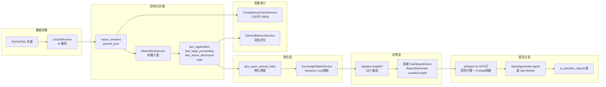

# GovInsight 后端化改造方案 · 全项目深度审核报告

> **审核时间**: 2026-04-14
> **审核范围**: 整个 KIROGOVCOMPARE 项目（后端 42 个 Service + 28 个 Route + 前端 GovInsight 模块 62 个文件，共 535KB）
> **审核对象**: 四份规划文档（Backendization Plan / Current State Audit / Foundation Freeze / Unit Type Foundation Plan）
> **审核方法**: 逐文件阅读源代码，将文档中的每一条关键判断与实际代码交叉验证

---

## 一、项目全景地图

在审核四份文档之前，我先完整梳理了项目架构，确保后续判断有据可依。

### 1.1 数据流全链路



### 1.2 关键文件规模

| 模块 | 文件 | 行数 | 职责 |
|------|------|------|------|
| 前端规则引擎 | `aiReport.ts` | **1874** | 指标计算、Prompt构建、规则兜底报告、数据标准化 |
| 前端驾驶舱 | `selectors.ts` | **866** | 指标率计算、排名、风险评级、对比分析 |
| 前端数据层 | `data.ts` | **379** | DB记录→前端对象转换、子级匹配、Legacy硬编码 |
| 后端一致性 | `ConsistencyCheckService.ts` | **1292** | 表2/3/4校验规则引擎 |
| 后端物化 | `MaterializeService.ts` | **514** | JSON→事实表拆解 |
| 后端指标 | `DerivedMetricsService.ts` | **399** | 风险评分聚合 |
| 后端路由 | `gov-insight.ts` | **792** | 大屏 + AI报告 API |
| 后端Worker | `GovInsightReportJobWorker.ts` | **424** | AI报告后台任务 |
| 前端报告页 | `ReportGenerator.tsx` | **910** | 报告展示 + 交互控制 |

---

## 二、文档结论逐条代码验证

### ✅ 已验证为正确的核心判断

#### 判断1：「前端承担了大量本应后端完成的伪计算」
**验证结果：完全属实，且比文档描述的更严重**

| 前端文件 | 具体业务逻辑 | 代码行 |
|----------|------------|--------|
| [aiReport.ts](file:///e:/Software%20Development/KIROGOVCOMPARE/frontend/src/govinsight/utils/aiReport.ts) | 同比计算、辅助风险等级评定、数据质量告警、记分卡构建、规则兜底完整正式报告 | 全1874行 |
| [selectors.ts](file:///e:/Software%20Development/KIROGOVCOMPARE/frontend/src/govinsight/leader-cockpit/selectors.ts) | 实质公开率（3种口径）、纠错率（2种口径）、红黄牌评级、稳定性评估、P90-P10差距、排名 | L61-866 |
| [riskPolicy.ts](file:///e:/Software%20Development/KIROGOVCOMPARE/frontend/src/govinsight/leader-cockpit/riskPolicy.ts) | 风险阈值常量、红/黄牌判定逻辑 | 全106行 |
| [data.ts](file:///e:/Software%20Development/KIROGOVCOMPARE/frontend/src/govinsight/data.ts) | `isDistrictName()` 后缀硬编码判定、Legacy 2024数据兜底 | L224-234, L5-41 |
| [DashboardHome.tsx](file:///e:/Software%20Development/KIROGOVCOMPARE/frontend/src/govinsight/views/DashboardHome.tsx) | `isDistrict()` 又一套独立的后缀判定、`getCorrectionRate()` 又一套纠错率计算 | L44-46, L93-97 |

> [!CAUTION]
> **文档未发现的重复问题**: `isDistrictName()` 函数在**三个地方**各自独立实现，后缀列表各不相同：
> - `data.ts:L224-233` — 12个后缀（含"镇"、"乡"、"街道"）
> - `selectors.ts:L593-596` — 6个后缀（缺"镇"、"乡"等）
> - `DashboardHome.tsx:L44-46` — 7个后缀（含"新城"但缺"园区"等）
>
> 这意味着**同一个实体在不同页面上可能被分类为不同类型**。这是文档提出 `canonical_units` 的核心动因之一，**但文档本身没有识别到前端已有三套不一致的分类逻辑**。

#### 判断2：「物化视图的 org_type 压缩造成失真」
**验证结果：完全属实**

[gov-insight.ts:L182-237](file:///e:/Software%20Development/KIROGOVCOMPARE/src/routes/gov-insight.ts#L182-L237) 直接 `SELECT ... FROM gov_open_annual_stats`，而该视图的 `org_type` 由 `migrations-llm.ts` 中的 `CASE WHEN` 二元分割逻辑生成，将所有非 `city` 实体统一归为 `district`。

#### 判断3：「Worker 无 schema 校验」
**验证结果：属实，但需要更精确的说法**

[GovInsightReportJobWorker.ts](file:///e:/Software%20Development/KIROGOVCOMPARE/src/services/GovInsightReportJobWorker.ts) 对 AI 返回结果做 `JSON.parse()` 后直接存储，无结构化校验。但 [MaterializeService.ts:L170-214](file:///e:/Software%20Development/KIROGOVCOMPARE/src/services/MaterializeService.ts#L170-L214) 的 `normalizeParsedPayload()` 已包含相当健壮的容错逻辑（深度解析、JSON fence清理、raw_text回退提取），**这不是"没有校验"，而是"有容错无校验"——容错保证不崩溃，但不拒绝有缺陷的数据**。

#### 判断4：「存储格式混杂」
**验证结果：属实**

[ai_decision_reports 表](file:///e:/Software%20Development/KIROGOVCOMPARE/src/routes/gov-insight.ts#L733-L741) 使用 `content_json JSONB` 存储整个报告，但无 version 字段、无 schema 标识。前端 [normalizeReportData()](file:///e:/Software%20Development/KIROGOVCOMPARE/frontend/src/govinsight/utils/aiReport.ts) 必须兼容多种格式——这正是文档所说的"协议未冻结"的根本原因。

#### 判断5：「`/ai-report/save` 无认证」
**验证结果：完全属实，这是真实安全漏洞**

```typescript
// gov-insight.ts:L709 — 注意：没有 authMiddleware！
router.post('/ai-report/save', async (req, res) => {
```

对比同文件其他写入路由：
```typescript
// gov-insight.ts:L480 — 有 authMiddleware
router.post('/ai-report/jobs', authMiddleware, async (req: AuthRequest, res) => {
// gov-insight.ts:L620 — 有 authMiddleware
router.get('/ai-report/jobs/latest', authMiddleware, async (req: AuthRequest, res) => {
```

而且在 [app-llm.ts:L68](file:///e:/Software%20Development/KIROGOVCOMPARE/src/app-llm.ts#L68)：
```typescript
app.use('/api/gov-insight', govInsightRouter); // Public dashboard API (no auth)
```

注释明确写了 "no auth"，这意味着整个 `/api/gov-insight/*` 路由树**在挂载层面就没有全局认证**，只有个别路由手动添加了 `authMiddleware`。**`/ai-report/save` 被遗漏了**。

---

### ⚠️ 需要修正/补充的文档判断

#### 修正1：「后端完全没有指标计算能力」
**实际情况：后端已有两个指标服务，被文档忽略了**

| 服务 | 文件 | 功能 |
|------|------|------|
| [DerivedMetricsService](file:///e:/Software%20Development/KIROGOVCOMPARE/src/services/DerivedMetricsService.ts) | 399行 | 按 report 维度聚合 quality_issue/fact 数量，计算 `derived_risk_score`，写入 `derived_unit_year_metrics` 和 `derived_region_year_metrics` |
| [ConsistencyCheckService](file:///e:/Software%20Development/KIROGOVCOMPARE/src/services/ConsistencyCheckService.ts) | 1292行 | 表2/3/4数据一致性校验引擎（含文本-数据交叉验证） |

这两个服务可以在后端化改造中**直接复用**，不需要从零搭建。文档应该在改造路径中标注这些已有资产。

#### 修正2：「adapter.ts 是实际使用的数据适配层」
**实际情况：adapter.ts 是废弃代码**

[adapter.ts](file:///e:/Software%20Development/KIROGOVCOMPARE/frontend/src/govinsight/services/adapter.ts) 定义了完整的 `RawDBRecord` 接口和 `transformYearData` 函数，但实际运行的代码路径是 `data.ts` 中的另一个 `transformYearData` 函数，两者字段不一致：
- `adapter.ts` 有 `fee_amount`，缺 `fees_amount`
- `adapter.ts` 有 `app_total_handled`，但 `data.ts` 用 `(app_new + app_carried_over)` 手动计算
- `adapter.ts` 完全缺少 `outcomesDetail` 相关的 18 个细分字段

> [!WARNING]
> 这是一个误导性文件——如果后端化改造时参考了 adapter.ts 的接口定义，会漏掉大量已在实际使用的字段。**应该标记为 deprecated 或删除**。

#### 修正3：「前端数据层使用硬编码兜底」
**实际情况：比文档描述的更系统性**

[data.ts:L5-41](file:///e:/Software%20Development/KIROGOVCOMPARE/frontend/src/govinsight/data.ts#L5-L41) 包含：
- `LEGACY_FEES_BY_YEAR` — 2020-2024 五年的行政事业性收费硬编码
- `LEGACY_2024_OUTCOME_DETAIL` — 2024年 18 个细分办理结果的硬编码数值

并在 L91 使用条件 `useLegacy2024OutcomeDetail`：当数据库中 2024 的细分值全为空时，自动切换到硬编码值。**这意味着当前大屏展示的 2024 年部分数据可能不是来自实际解析，而是硬编码的**。后端化改造必须先确认这些遗留兜底是否仍在生效。

---

## 三、文档完全未覆盖的关键发现

以下发现来自对文档**未提及**的项目文件的审查：

### 发现1：Leader Cockpit 整个模块未被纳入改造范围

[leader-cockpit/](file:///e:/Software%20Development/KIROGOVCOMPARE/frontend/src/govinsight/leader-cockpit/) 模块（13 文件、~65KB）包含：
- **selectors.ts (866行)**: 完整的指标体系（压力/质量/风险/监管结构比）、年度趋势序列、三级原因分类体系（A=法定不公开/B=信息资产不足/C=程序性不予处理）、整改行动包模板
- **riskPolicy.ts**: 红黄牌判定阈值（公开率 < 40% 红牌 / < 45% 黄牌；纠错率 > 15% 红牌 / > 10% 黄牌）
- **components/**、**sections/**、**utils/stats.ts**: 完整的可视化和统计工具（百分位计算、P90-P10差距等）

> [!IMPORTANT]
> **这是项目中规则密度最高的模块，但四份文档完全没有提到它。** 后端化方案只讨论了 `aiReport.ts` 中的逻辑迁移，**没有考虑 Leader Cockpit 的 866 行前端指标计算/风险评级是否也需要迁移**。
>
> 如果只迁移 `aiReport.ts` 而不处理 `selectors.ts`，会出现以下矛盾：
> - 后端计算的"实质公开率"用口径 A
> - Leader Cockpit 前端计算的"实质公开率"用口径 B（支持 3 种变体切换）
> - 两处可能产生不同数值

### 发现2：PDF 导出链路的特殊依赖

[gov-insight-pdf.ts](file:///e:/Software%20Development/KIROGOVCOMPARE/src/routes/gov-insight-pdf.ts) 使用 Puppeteer 在后端启动浏览器，导航到前端打印页面来生成 PDF。这意味着：
1. **PDF 导出依赖于运行中的前端服务**（L128: `findFrontendUrl()`）
2. **前端的报告渲染逻辑直接影响 PDF 输出质量**
3. 后端化改造如果改变了前端数据流，**PDF 导出会同时受影响**

文档的三步走方案没有考虑这个跨端依赖。

### 发现3：`/api/ai/generate-report` 路由独立于 GovInsight 存在

[ai.ts](file:///e:/Software%20Development/KIROGOVCOMPARE/src/routes/ai.ts) 提供了通用的 AI 生成接口，支持 6 个模型提供方（Gemini/OpenAI/Nvidia/Zhipu/ModelScope/Stub），**有 `authMiddleware` 保护**。

但前端 `ReportGenerator.tsx` 的 AI 生成路径已改为先创建 Job `POST /ai-report/jobs`，再由后台 Worker 异步处理。所以 `/api/ai/generate-report` 可能只用于非 GovInsight 场景。**文档没有说明这两条路径的关系和最终收敛方向**。

### 发现4：`GovInsightStatsService` 的物化视图刷新有潜在性能隐患

[GovInsightStatsService.ts](file:///e:/Software%20Development/KIROGOVCOMPARE/src/services/GovInsightStatsService.ts) 使用 `pg_advisory_lock` 串行化刷新，但 `REFRESH MATERIALIZED VIEW` 是**非并发**的（没有 CONCURRENTLY），会在刷新期间阻塞所有读取查询。

当未来迁移到 `gov_open_annual_stats_v2` 正式表后，这个问题自然消除——但在过渡期间（同时存在视图和新表），刷新策略需要明确。

### 发现5：前端 `data.ts` 中的 `isDistrictName` 还控制着数据合并逻辑

[data.ts:L355](file:///e:/Software%20Development/KIROGOVCOMPARE/frontend/src/govinsight/data.ts#L355)：
```typescript
if (!childRecordsMap.has(normalizedChildId) && isDistrictName(existingChild.name)) {
    mergedChildren.push({ ...existingChild, data: existingChild.data || [] });
}
```

这意味着不符合 `isDistrictName` 判定的子级实体（如"大数据管理中心"）即使存在但无数据，也**不会被保留在合并结果中**——它们会被静默丢弃。这直接影响到文档所说的"部门级数据常被忽略"问题。

### 发现6：`ReportGenerator` 已实现了双引擎架构

[ReportGenerator.tsx](file:///e:/Software%20Development/KIROGOVCOMPARE/frontend/src/govinsight/views/ReportGenerator.tsx) 已经支持：
- **AI 引擎** (L427-469): 通过后台 Job Worker 异步生成
- **规则引擎** (L412-425): 调用 `buildRuleBasedEnhancedReport()` 同步生成兜底稿

文档建议的"规则兜底 + AI 增强"实际上**已经在前端实现了**。后端化的重点不是"增加规则兜底能力"（这个已有），而是将现有的 1874 行规则逻辑从前端搬到后端。

### 发现7：`DashboardHome.tsx` 的 `districts` import 是空数组

```typescript
import { districts } from '../data';
// data.ts:L82
export const districts: EntityProfile[] = [];
```

[DashboardHome.tsx:L143](file:///e:/Software%20Development/KIROGOVCOMPARE/frontend/src/govinsight/views/DashboardHome.tsx#L142-L148) 的 `handleDrillDown` 使用 `districts.find()` 来实现下钻导航——但 `districts` 始终为空数组，所以**四象限图和热力榜的下钻功能实际上是坏的**。这是一个现存 Bug，不是文档讨论的范围但值得记录。

---

## 四、安全问题精确定位

| # | 风险 | 位置 | 严重性 | 修复方式 |
|---|------|------|--------|---------|
| S1 | `/ai-report/save` **无 authMiddleware** | [gov-insight.ts:L709](file:///e:/Software%20Development/KIROGOVCOMPARE/src/routes/gov-insight.ts#L709) | 🔴 高 | 添加 `authMiddleware` |
| S2 | `/ai-report` GET 无认证，报告内容可公开访问 | [gov-insight.ts:L755](file:///e:/Software%20Development/KIROGOVCOMPARE/src/routes/gov-insight.ts#L755) | 🟡 中 | 如报告含敏感内容，需添加认证 |
| S3 | `/annual-data` 无认证，统计数据可公开访问 | [gov-insight.ts:L104](file:///e:/Software%20Development/KIROGOVCOMPARE/src/routes/gov-insight.ts#L104) | 🟡 中 | 大屏场景可能需要公开，需确认业务意图 |
| S4 | 整个 `govInsightRouter` 注释明确写 "no auth" | [app-llm.ts:L68](file:///e:/Software%20Development/KIROGOVCOMPARE/src/app-llm.ts#L68) | ⚠️ 架构 | 应改为默认认证 + 个别路由豁免 |
| S5 | token 比较未使用 constant-time compare | [auth.ts:L79](file:///e:/Software%20Development/KIROGOVCOMPARE/src/middleware/auth.ts#L79) | 🟡 中 | 使用 `crypto.timingSafeEqual` |

---

## 五、修正后的实施路线图

基于全项目审查，我对文档提出的三步走进行以下修正：

### 第 0 步：安全修补 + 底座落地（1-2 周）

```
优先级：🔴 立即执行，不依赖任何规划讨论
```

| 任务 | 详情 |
|------|------|
| 0.1 修复 S1 安全漏洞 | `gov-insight.ts:L709` 添加 `authMiddleware` |
| 0.2 统一 `isDistrictName` | 删除 3 处独立实现，建立单一 `canonical_unit_type` 函数 |
| 0.3 标记 `adapter.ts` 为 deprecated | 避免后续开发被误导 |
| 0.4 建 `canonical_units` 映射表 | 按 Unit Type Foundation Plan 执行 |
| 0.5 建 `gov_open_annual_stats_v2` 正式表 | 替代物化视图，含 `unit_type` 字段 |
| 0.6 数据对账脚本 | v1 视图 vs v2 表的自动化对照 |

### 第 1 步：指标计算后端化（2-3 周）

```
优先级：🟡 底座稳定后立即启动
关键约束：前端必须能透明切换数据源
```

| 任务 | 详情 |
|------|------|
| 1.1 建后端 MetricsService | 迁移 `selectors.ts` 中的核心指标计算（公开率、纠错率、排名） |
| 1.2 建后端 RiskAssessmentService | 迁移 `riskPolicy.ts` 的红黄牌逻辑 |
| 1.3 **新增 `/api/gov-insight/metrics` 接口** | 返回计算完成的指标，前端只做展示 |
| 1.4 前端 Leader Cockpit 切源 | `selectors.ts` 改为消费后端接口，保留前端计算作为 fallback |
| 1.5 单元测试 | 后端计算结果与前端现有计算的自动化对账 |

> [!IMPORTANT]
> 文档完全遗漏了 Leader Cockpit 的 866 行处理。本步骤应**同时**覆盖 `aiReport.ts` 和 `selectors.ts` 中的指标逻辑。

### 第 2 步：规则+报告 Payload 后端化（2-3 周）

| 任务 | 详情 |
|------|------|
| 2.1 迁移 `buildRuleBasedEnhancedReport()` | 从 aiReport.ts 迁移规则引擎到后端 |
| 2.2 迁移 `buildReportContextPayload()` | 报告上下文构建后端化 |
| 2.3 冻结 Payload Schema | 建立 `report_payload_v1` 的 JSON Schema |
| 2.4 Worker 增加 schema 校验 | AI 返回结果写入前必须通过 schema 验证 |
| 2.5 `ai_decision_reports` 增加 version 字段 | 存储 payload schema 版本号 |

### 第 3 步：清理 + 稳定化（1-2 周）

| 任务 | 详情 |
|------|------|
| 3.1 移除 `LEGACY_FEES_BY_YEAR` 等硬编码 | 确认数据库已覆盖后彻底删除 |
| 3.2 清理 `adapter.ts` | 删除废弃文件 |
| 3.3 **统一 auth 策略** | `govInsightRouter` 改为默认认证，大屏公开路由显式豁免 |
| 3.4 PDF 导出适配 | 验证新数据流下 Puppeteer 渲染不受影响 |
| 3.5 前端瘦身 | 删除已迁移到后端的计算逻辑 |
| 3.6 下钻 Bug 修复 | 修复 `DashboardHome` 中 `districts` 空数组导致的下钻失效 |

---

## 六、最终结论与评价

### 文档质量评分

| 维度 | 评分 | 理由 |
|------|------|------|
| 问题诊断准确性 | ⭐⭐⭐⭐⭐ | 核心瓶颈识别精准（口径不统一、规则错位、协议未冻结），经代码验证全部属实 |
| 改造方向正确性 | ⭐⭐⭐⭐⭐ | "规则驱动+数据计算+AI撰写"的分层架构方向完全正确 |
| 项目覆盖完整性 | ⭐⭐⭐☆☆ | **遗漏了 Leader Cockpit 模块、PDF导出链路、已有后端资产（DerivedMetrics/Consistency）、adapter.ts 废弃代码** |
| 落地可操作性 | ⭐⭐⭐☆☆ | 缺实施排期、测试策略、灰度切换方案、验收标准 |
| 安全考量 | ⭐⭐☆☆☆ | 只在审计文档中提到了安全问题但未给出修复优先级，且遗漏了 S4/S5 |

### 核心判断

> **改造方案的战略方向完全正确**——底座先行、规则后端化、协议冻结，这三个优先级排序是对的。
>
> **但方案对项目实际代码的了解不够全面**——遗漏了前端最大的规则模块（Leader Cockpit）、后端已有的指标服务、以及多个跨模块耦合点（PDF导出、isDistrictName 三处重复、adapter.ts 误导）。这些遗漏不会改变方向，但会影响工时估算和实施顺序。

### 立即行动项（按优先级）

1. 🔴 **今天修**: `gov-insight.ts:L709` 添加 `authMiddleware`（5 分钟）
2. 🟡 **本周做**: 统一三处 `isDistrictName` 实现
3. 🟡 **本周做**: 标记 `adapter.ts` 为 deprecated
4. 📋 **纳入规划**: 将 Leader Cockpit 的指标/风险逻辑列入后端化范围
5. 📋 **纳入规划**: 为每个步骤补充 Definition of Done 和验收标准
