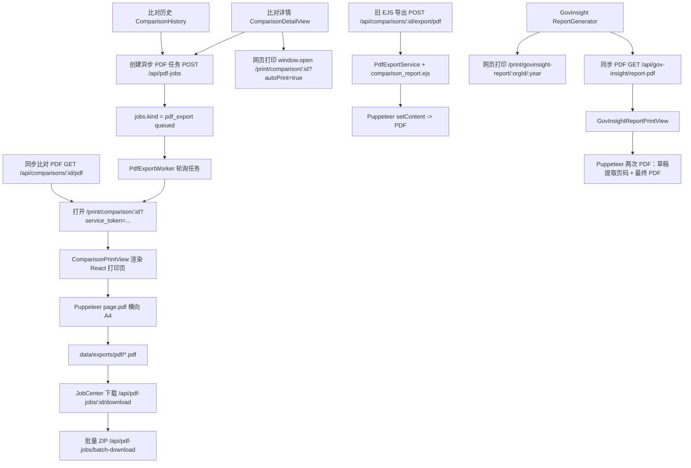
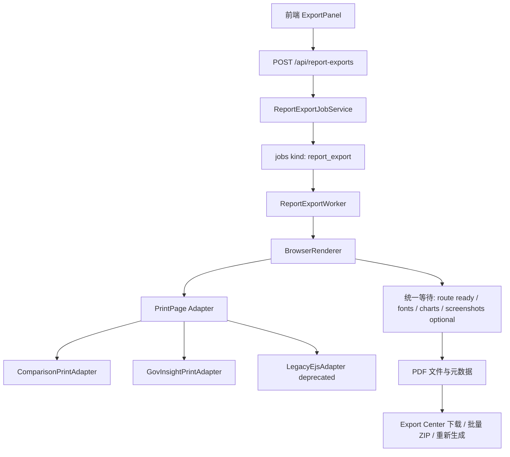

# 报告打印与 PDF 导出审计

审计日期：2026-05-19  
审计范围：React 打印页、GovInsight 打印页、PDF 路由、PDF worker、旧 EJS PDF 服务、打印 CSS。

## 一、当前 PDF / 打印链路图

## 二、链路明细

| 链路 | 入口 | 后端接口 | 前端打印页 | 生成方式 | 当前状态 |
| --- | --- | --- | --- | --- | --- |
| 比对异步 PDF 任务 | `ComparisonDetailView.js`、`ComparisonHistory.js` | `POST /api/pdf-jobs`、`GET /api/pdf-jobs`、`GET /api/pdf-jobs/:id/download` | `/print/comparison/:id` -> `ComparisonPrintView.js` | `PdfExportWorker.ts` Puppeteer 横向 A4，保存到 `data/exports/pdf` | 当前主链路 |
| 比对同步 PDF | 直接请求 `GET /api/comparisons/:id/pdf` | `src/routes/pdf-export.ts` | `/print/comparison/:id` -> `ComparisonPrintView.js` | 路由内 Puppeteer 直接返回 PDF | 仍注册在 `app-llm.ts`，但前端主入口未直接使用 |
| 比对网页打印 | `ComparisonDetailView.js` 的打印按钮 | 无 | `/print/comparison/:id?autoPrint=true` | 浏览器打印 | 适合作为预览/临时打印 |
| 旧 EJS 比对 PDF | `POST /api/comparisons/:id/export/pdf`、旧任务路由可能调用 | `comparison-history.ts`、`comparisons.ts` | `src/views/comparison_report.ejs` | `PdfExportService.ts` + EJS + Puppeteer `setContent` | 旧实现仍被调用 |
| GovInsight 网页打印 | `ReportGenerator.tsx` | 无 | `/print/govinsight-report/:orgId/:year` -> `GovInsightReportPrintView.tsx` | 浏览器打印 | 页面打印链路 |
| GovInsight 同步 PDF | `ReportGenerator.tsx` | `GET /api/gov-insight/report-pdf` | 同上 | 路由内 Puppeteer，等待 ready、字体、目录页码、图表稳定，最终返回 PDF | 当前 GovInsight 主导出链路 |
| PDF 批量下载 | `JobCenter.js` 下载 tab | `POST /api/pdf-jobs/batch-download` | 无 | 已生成 PDF 文件打 ZIP | 依赖异步 PDF 任务产物 |

## 三、重复实现与旧实现问题

| 问题 | 涉及文件 | 证据 | 风险 |
| --- | --- | --- | --- |
| 比对 PDF 有三套生成器 | `pdf-export.ts`、`PdfExportWorker.ts`、`PdfExportService.ts` | 同步路由、异步 worker、EJS service 都能生成比对 PDF | 修复一个链路不等于全链路修复，导出结果不一致 |
| 旧 EJS PDF 仍被调用 | `src/routes/comparisons.ts`、`src/routes/comparison-history.ts` | 仍 import `PdfExportService` 并调用 `generateComparisonPdf` | 旧模板依赖 Tailwind CDN 和 EJS partial，长表格/字体/离线稳定性弱 |
| 前端主链路使用异步任务，但同步路由仍注册 | `src/app-llm.ts` | `app.use('/api/comparisons', pdfExportRouter)` 与 `/api/pdf-jobs` 并存 | 用户或旧调用方可能绕过任务中心，长报告请求超时风险高 |
| `ComparisonPrintView.js` 导入屏幕态 CSS | `ComparisonPrintView.js` | `import '../ComparisonDetailView.css'` | 打印页受屏幕态布局、Tailwind-like 工具类和 print CSS 共同影响 |
| GovInsight 与比对 PDF 分别实现 Puppeteer 查找前端、等待、字体、分页逻辑 | `gov-insight-pdf.ts`、`pdf-export.ts`、`PdfExportWorker.ts` | 各自实现 `findFrontendUrl`、Puppeteer launch、ready wait | 维护成本高，环境变量和失败诊断不一致 |

## 四、打印 CSS 与分页风险

### 全局 print CSS 冲突

| 文件 | 风险点 |
| --- | --- |
| `frontend/src/App.css` | 全局 `@media print` 隐藏 `.header/.nav/.footer`，重置 `.main` |
| `frontend/src/govinsight/tailwind.css` | `@media print` 下全局改 `html/body/main/nav/header/footer/table`，且 `@page margin: 0` |
| `frontend/src/components/ComparisonDetailView.css` | 含 `@media print`，又被 `ComparisonPrintView.js` 导入 |
| `frontend/src/components/print/ComparisonPrintView.css` | 定义横向 `@page`、`@page comparison-landscape` |
| `frontend/src/components/print/GovInsightReportPrintView.css` | 定义 A4 纵向 `@page` 与大量分页规则 |

结论：当前 print CSS 不是单一来源，打印结果依赖 CSS 加载顺序和选择器优先级。历史经验也提示 print/export 问题应优先检查 `@media print` scope 和主字体/布局是否被 reset 覆盖。

### 长内容分页风险

| 场景 | 当前规则 | 风险 |
| --- | --- | --- |
| 比对长表格 | `ComparisonPrintView.css` 对 table_2/table_3 做缩放和横向布局，部分使用 `zoom: 0.65` inline style | 内容变小但不一定分页稳定，极长表格可能仍被压缩或截断 |
| GovInsight 章节页 | `.pdf-page` 固定 min-height，每章 `break-before: page` | 单章内容超过一页时依赖内部块的 break 规则，目录页码需二次修正 |
| GovInsight 表格 | 多处 `break-inside: avoid`，部分表格又允许 `auto` | 长表格在“避免断页”和“必须断页”之间存在冲突 |
| 图表 | `gov-insight-pdf.ts` 手动稳定 Recharts 宽高 | 有专项处理，但仅 GovInsight PDF 路由有；网页打印不一定执行该稳定逻辑 |
| 页眉页脚 | GovInsight 后端使用 Puppeteer `displayHeaderFooter`；React `PageChrome` 返回 null | 页面预览和最终 PDF 页眉页脚不一致 |
| 目录页码 | React 先估算，后端再生成草稿 PDF 提取文本修正 | 技术上可行，但慢；若章节标题文本变化或 PDF 文本提取失败，目录回退为估算 |

## 五、ready 标记检查

| 打印页 | ready 标记 | 字体加载 | 图表稳定 | 目录页码 | 页眉页脚 | 结论 |
| --- | --- | --- | --- | --- | --- | --- |
| `ComparisonPrintView` | `#comparison-content[data-print-ready="true"]`，同时设置 `window.__COMPARISON_PRINT_READY__` | 未显式等待 `document.fonts.ready` | 无专项 Recharts 稳定 | 不涉及目录 | `displayHeaderFooter: false` | ready 依赖数据和 checksReady，字体/长表格稳定性仍弱 |
| `GovInsightReportPrintView` | `html[data-govinsight-pdf-ready="true"]` | 后端显式等待 `document.fonts.ready` | 后端对 Recharts 容器和 SVG 做三次稳定 | 先 DOM 估算，再草稿 PDF 文本提取修正 | 后端 Puppeteer header/footer | 当前最完整，但复杂、慢、与网页打印表现不完全一致 |
| 旧 EJS `comparison_report.ejs` | 无 ready 标记 | 依赖 Google Fonts/Tailwind CDN | 无 | 无 | 简单 footerTemplate | 离线和长内容稳定性最低，不适合作为长期链路 |

## 六、风险点

| 编号 | 风险 | 影响 | 建议 |
| --- | --- | --- | --- |
| PDF-01 | 比对导出链路重复，旧 EJS 仍可被调用 | 结果不一致、修复遗漏 | P0 梳理入口，明确推荐链路和 deprecated 链路 |
| PDF-02 | GovInsight `tailwind.css` print reset 作用域过大 | 可能影响其他打印页 | P0 收敛作用域 |
| PDF-03 | 比对打印页没有等待字体加载 | 中文字体、表格宽度、分页可能抖动 | P0 在 `pdf-export.ts` 和 worker 中增加 `document.fonts.ready` 等待 |
| PDF-04 | 比对长表格靠缩放和 `break-inside` 混合控制 | 极长表格可能截断或空白页 | P1 建长表格分页策略和测试样本 |
| PDF-05 | 同步 PDF 路由直接生成大文件 | 长报告可能超时、占用请求线程 | P1 将同步路由降级为兼容入口，内部转异步任务或限制使用 |
| PDF-06 | `ComparisonPrintView` 导入屏幕态 CSS | 打印 CSS 不可预测 | P1 抽共享样式或移除屏幕态依赖 |
| PDF-07 | GovInsight 目录页码依赖 PDF 文本提取 | 标题变更或抽取失败会错页 | P1 为目录页码增加失败诊断和快照测试 |
| PDF-08 | 批量导出只打包已完成文件 | 用户选中未完成或过期文件时反馈弱 | P0 在 JobCenter 显示“可下载/已过期/生成中”批量摘要 |
| PDF-09 | PDF worker 清理过期文件后只清 `file_path/file_size` | 用户看到历史任务但文件失效 | P0 下载任务行内提供重新生成并解释过期原因 |
| PDF-10 | Puppeteer launch 配置分散 | Windows/服务器 Chrome 路径、sandbox、字体环境差异 | P1 抽统一 `ReportExportService`/`BrowserRenderer` |

## 七、建议统一成 ReportExportService 架构

目标：保留现有主链路，先统一抽象，不一次性替换全部导出。

核心接口建议：

| 模块 | 职责 |
| --- | --- |
| `ReportExportJobService` | 创建导出任务，记录类型、来源、标题、参数、权限快照 |
| `ReportExportWorker` | 单 worker 或队列消费，统一进度、失败原因、重试 |
| `BrowserRenderer` | 统一 Puppeteer launch、frontend URL、auth token、ready wait、字体、截图诊断 |
| `PrintPageAdapter` | 每种报告声明 route、page size、orientation、ready selector、是否需要图表稳定、是否需要二次目录页码 |
| `ExportCenter` | 前端统一查看导出任务、下载、批量、过期重生成 |

迁移路径：

1. P0：不改数据库 schema，先文档化当前入口并隐藏/降级旧 EJS 前端入口。
2. P1：让比对同步路由和异步 worker 共用同一个 `BrowserRenderer`。
3. P1：GovInsight PDF 也接入同一个 renderer，但保留自己的二次目录页码 adapter。
4. P2：废弃 `PdfExportService.ts` + `comparison_report.ejs`，或仅保留为历史兼容。

## 八、长报告稳定性测试建议

### 样本矩阵

| 样本 | 目的 |
| --- | --- |
| 比对报告：短文本 + 少量表格 | 基线渲染和文件下载 |
| 比对报告：table_2/table_3/table_4 全部存在 | 表格布局和横向 A4 |
| 比对报告：table_3 超长行/多问题 badge | 长表格分页、问题标记不截断 |
| 比对报告：正文超长章节 | 文本分页、标题不孤行 |
| GovInsight：无图表或少图表 | 基线 |
| GovInsight：多 Recharts 图表 | 图表宽高稳定 |
| GovInsight：层级摘要长表格 | 纵向分页与目录页码 |
| 批量导出：10/50/100 个任务 | worker 队列、文件过期、ZIP 生成 |

### 自动化检查

1. 对每条 PDF 链路生成 PDF 后检查文件大小、页数、是否包含关键标题文本。
2. 渲染 PDF 首页、目录页、长表格页为 PNG，做视觉快照。
3. 检查 PDF 文本中是否出现 `undefined`、`null`、乱码占位、空标题。
4. 对 GovInsight 目录页码做“目录文本页码 vs 实际章节页”比对。
5. 对比对 PDF 检查 `#comparison-content[data-print-ready=true]`、字体加载、表格根节点宽度。
6. 批量导出压测记录：平均耗时、失败率、单 worker 队列长度、最大内存。

## 九、低风险先修建议

1. 明确当前推荐链路：比对 PDF 以 `/api/pdf-jobs` 异步任务为准；GovInsight 以 `/api/gov-insight/report-pdf` 为准。
2. 给旧 EJS 路由加 deprecated 注释和调用日志，后续确认无前端入口后下线。
3. 收敛 `govinsight/tailwind.css` 的 print 全局 reset。
4. 在比对 PDF worker/sync route 中等待 `document.fonts.ready`。
5. 在 JobCenter 下载 tab 中展示“文件已过期可重新生成”“生成中不可批量下载”的批量摘要。

