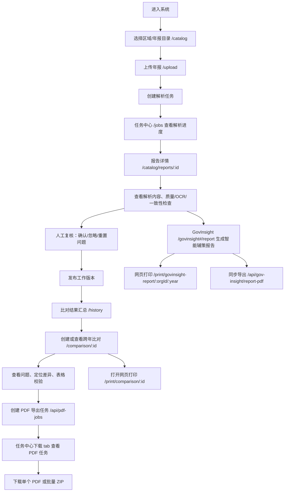
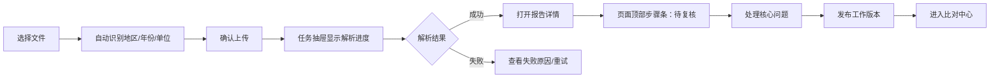

# 用户体验与业务流程审计

审计日期：2026-05-19  
审计范围：`frontend/src/App.js`、`frontend/src/components/**/*.js`、`frontend/src/govinsight/**/*.tsx` 中的导航、弹窗、任务流、报告查看与导出入口。

## 一、交互调用统计

静态扫描结果：

| 类型 | 数量 | 主要集中位置 |
| --- | ---: | --- |
| `alert()` / `window.alert()` | 82 | `JobCenter.js` 18、`ComparisonHistory.js` 10、`CityIndex.js` 8、`CreateTask.js` 7、`RegionsManager.js` 7、`UserManagement.js` 6 |
| `confirm()` / `window.confirm()` | 22 | `ComparisonHistory.js` 5、`ReportDetail.js` 4、`CityIndex.js` 2，其余分散 |
| `window.location` / `location.assign` | 34 | `App.js`、`CityIndex.js`、`ReportMaintenance.js`、`UploadReport.js`、`ReportGenerator.tsx` |
| `window.open()` | 3 | 比对打印、任务导出、GovInsight 打印 |
| `window.history` | 6 | `App.js`、`ReportDetail.js`、`CityIndex.js`、`ReportMaintenance.js`、打印页清理 token |

已有局部替代能力：

- `JobCenter.js` 有自定义 `showConfirm` 和 confirm modal，但只在任务中心内部使用。
- `RegionsManager.js` 有自定义 confirm modal，但同样是页面内私有实现。
- `ReportMaintenance.js` 有抽屉。
- `CompareFailureModal.js`、`RiskRuleModal.tsx`、`MissingDataModal.tsx`、`EvidenceDrawer.tsx` 等说明项目已有 modal/drawer 模式，但没有全局交互服务。
- `NotificationCenter.js` 存在，但在 `App.js` 中被移出 header，当前不是统一 Toast/通知入口。

## 二、当前业务流程图

## 三、用户卡点

| 编号 | 卡点 | 当前表现 | 影响 | 建议 |
| --- | --- | --- | --- | --- |
| UX-01 | 上传后解析进度与下一步入口依赖跳转 | `BatchUpload.js`、`UploadReport.js` 中直接 `window.location.href = /jobs...` | 用户被带离上传上下文，不清楚后续是解析、复核还是发布 | 上传完成后显示任务抽屉，提供“查看任务 / 继续上传 / 打开报告” |
| UX-02 | 原生 alert/confirm 打断业务流 | 82 个 alert、22 个 confirm | 浏览器弹窗不可样式化、不可聚合、不可保留上下文 | 成功/失败用 Toast；危险操作用统一 Modal；长任务用任务抽屉 |
| UX-03 | “复核发布”不是主流程导航的一等入口 | 复核藏在报告详情内部，发布与一致性检查混在同页 | 新用户不容易理解“解析完成后必须复核发布，才能比对” | 在任务中心和报告详情顶部加入状态步骤条：解析中/待复核/待发布/已发布/可比对 |
| UX-04 | 比对生成入口分散 | `CityIndex.js` 可选两份报告创建，比对历史也有批量创建 | 用户不知道应该从目录、详情还是历史发起比对 | 统一为“比对中心”：待生成、生成中、已生成、失败 |
| UX-05 | 导出报告入口有“创建任务”和“网页打印”两套心智 | `ComparisonDetailView.js` 同时有异步 PDF 和 print view；GovInsight 也有打印和导出 | 用户不清楚哪个更稳定、哪个能批量、哪个带目录页码 | 统一“导出中心”面板：推荐 PDF 任务，打印作为预览/临时能力 |
| UX-06 | 任务中心同时承载上传任务和 PDF 下载，但导航文案不够流程化 | `/jobs` tab 区分 upload/download | 用户从“PDF 任务已创建”跳转后，需要再理解 tab | URL 保留 `?tab=download`，页面顶部解释当前任务来源与下一步 |
| UX-07 | 页面返回行为不统一 | `ReportDetail` 用 `window.history.back()`，其他页面用 `navigate()` | 深链进入时返回可能离开系统或行为不确定 | 所有详情页传入明确 `returnTo`，缺省回到业务列表 |
| UX-08 | GovInsight 是 HashRouter 子应用 | `/govinsight#/report` 与主应用路径体系不同 | 深链、面包屑、浏览器历史和权限感知割裂 | 短期保留；P2 统一路由前先建立导航 registry |
| UX-09 | 部分操作成功只弹窗，不更新页面状态 | 批量校验、批量导出、重试、删除等多处 alert | 用户需要手动确认列表状态是否变化 | 操作完成后 Toast + 局部刷新 + 状态摘要 |
| UX-10 | 长任务缺少统一进度可见性 | 解析、AI 报告、PDF 导出分别自建轮询 | 多任务并行时用户不知道后台还有什么在跑 | 建公共 `TaskDrawer`，展示解析、比对、PDF、AI 报告任务 |

## 四、哪些操作应替换为哪种交互

| 当前操作 | 当前方式 | 建议方式 | 优先级 |
| --- | --- | --- | --- |
| 表单校验失败，如未选文件、未选报告、未分配区域 | `alert()` | 页面内字段错误 + Toast | P0 |
| 创建 PDF 任务成功 | `confirm()` 询问是否去任务中心 | Toast + 任务抽屉 + “查看任务”按钮 | P0 |
| 删除报告、删除比对、删除任务、取消任务 | `confirm()` | 统一危险确认 Modal，显示对象名和影响范围 | P0 |
| 批量导出、批量校验 | `confirm()` + `alert()` | Modal 确认 + 进度条/任务抽屉 + 完成摘要 | P1 |
| 文件过期重新生成 | 页面内 confirm | 下载任务行内状态 + “重新生成”按钮 + Toast | P0 |
| AI 报告生成失败 / PDF 导出失败 | `alert()` | 页面内错误条 + 保留重试按钮 | P0 |
| 页面跳转 | `window.location.href` | 统一 `navigate()` 或 route helper | P1 |
| 打开打印页 | `window.open()` | 保留，但失败时用页面内提示并提供可复制链接 | P1 |

## 五、建议的新导航结构

建议从“模块导航”调整为“业务流程导航”：

1. **年报工作台**
   - 年报目录
   - 上传年报
   - 解析任务
   - 待复核发布
2. **问题复核**
   - 待处理问题
   - 质量/OCR 风险提示
   - 已确认/已忽略记录
3. **比对中心**
   - 待生成比对
   - 比对结果
   - 失败重试
4. **导出中心**
   - PDF 导出任务
   - 批量下载
   - 历史导出与过期文件
5. **智能治理**
   - GovInsight 总览
   - 智能辅策报告
   - Leader Cockpit
6. **系统管理**
   - 区域管理
   - 用户管理
   - 报告维护

短期不建议一次性改路由。先在现有导航上增加“流程状态入口”和“导出中心入口”，并把 `/jobs?tab=download` 的下载任务从任务中心中更清楚地命名。

## 六、建议的新操作流

### 年报上传到发布

### 比对到导出

## 七、需要新增的公共组件清单

| 组件 | 目标 | 替代对象 | 优先级 |
| --- | --- | --- | --- |
| `ToastProvider` / `useToast` | 成功、失败、轻量提示统一 | 大多数 `alert()` | P0 |
| `ConfirmDialogProvider` / `useConfirm` | 危险操作确认统一 | 大多数 `confirm()` | P0 |
| `TaskDrawer` | 上传、解析、PDF、AI 报告任务进度统一 | 跳转到任务中心后的上下文丢失 | P1 |
| `PageHeader` | 标题、状态、主操作按钮统一 | 各页面自写 header | P1 |
| `StepStatusBar` | 上传-解析-复核-发布-比对-导出流程可见 | 报告详情和任务中心状态分散 | P1 |
| `DataTable` | 列表页表格统一 | `CityIndex`、`JobCenter`、`ComparisonHistory`、`ReportMaintenance` |
| `StatusBadge` | 状态文案、颜色、图标统一 | 重复 `.status-badge` | P0/P1 |
| `EmptyState` / `ErrorState` | 空态、错误态统一 | 重复 `.empty`、`.error` | P1 |
| `ExportPanel` | 导出选项、任务创建、下载入口统一 | 比对详情、比对历史、GovInsight 导出 | P1 |

## 八、低风险先修建议

1. 先新增 `Toast` 和 `ConfirmDialog` 基础能力，只替换高频且低风险的 `alert`/`confirm`：PDF 任务创建成功、下载失败、文件过期重新生成、表单校验失败。
2. 将 `window.location.href = '/jobs?tab=download'` 替换为统一导航 helper，保持 URL 行为不变。
3. 在报告详情顶部补状态说明：当前版本是否待复核、是否已发布、是否可进入比对。
4. 在任务中心下载 tab 顶部增加导出任务说明和批量下载条件。
5. GovInsight 报告页的 PDF 导出失败改为页面内错误提示，避免用户在长时间等待后只看到浏览器弹窗。

